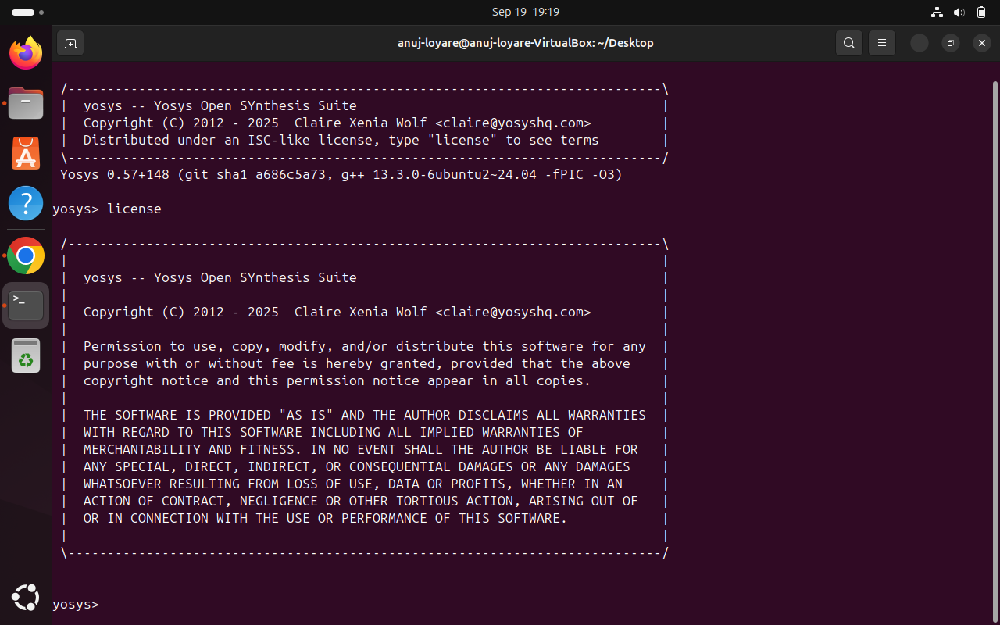
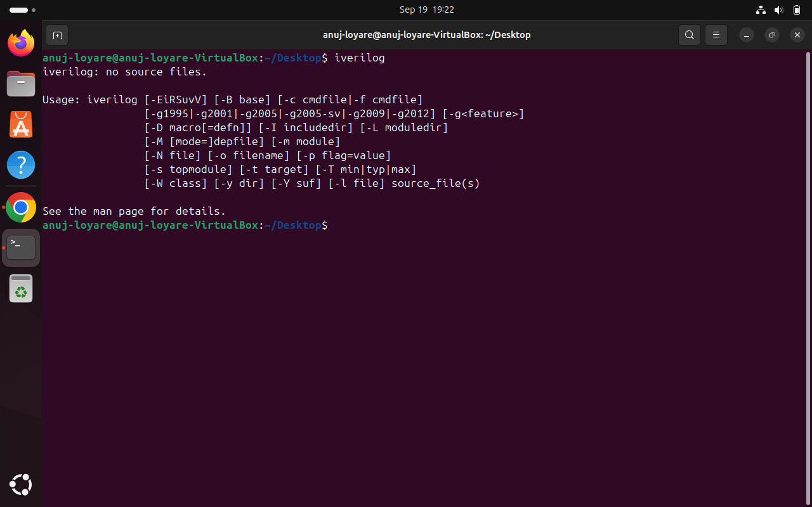
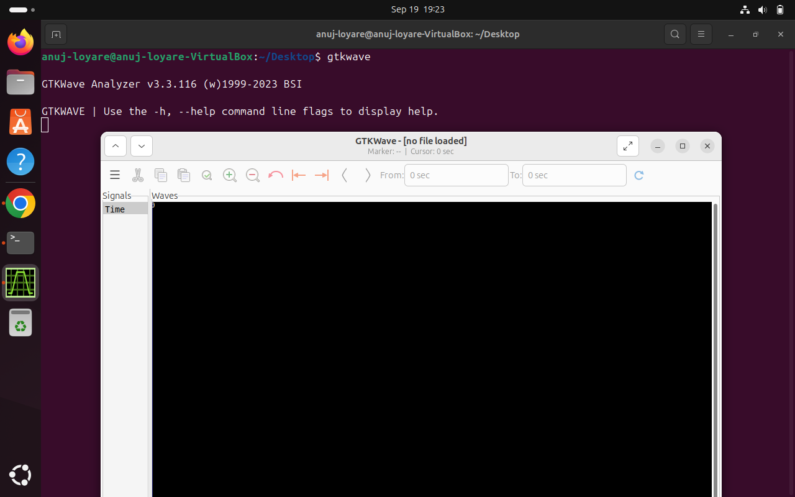
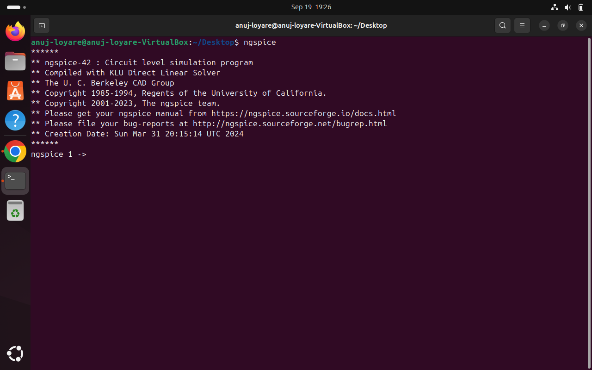
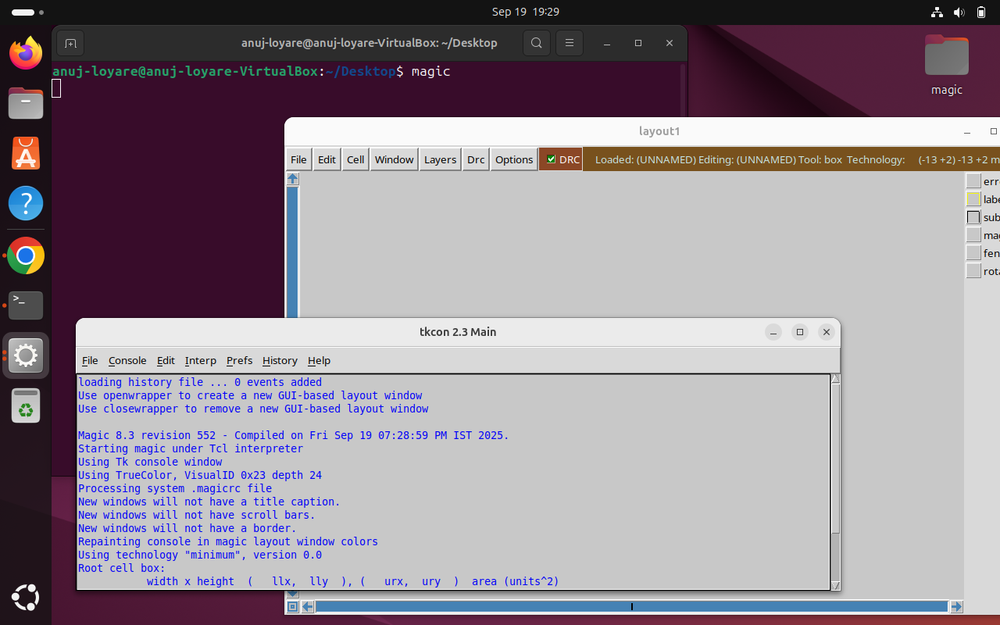

# 🚀 Week 0: VLSI System Design (VSD) Program Foundation & Tool Setup

<div align="center">


</div>

Welcome to my **VLSI System Design (VSD) Program** repository! This week focused on setting up the development environment and installing the essential open-source tools that will be used throughout the program. The goal was to create a reliable and efficient workspace for synthesis, simulation, and design tasks.

---

## 🎯 **System and Virtual Machine Configuration**

To ensure optimal performance, I configured a **Virtual Machine (VM)** with the following specifications:

<div align="center">

| **Specification** 💻    | **Details** 📋          |
|-----------------------|-----------------------|
| **Operating System** 🐧  | Ubuntu 20.04+         |
| **RAM** 💾               | 6GB                   |
| **Storage** 💿           | 50GB HDD              |
| **vCPUs** ⚡             | 4                     |

</div>

> 💡 **Pro Tip:** This setup guarantees sufficient resources for handling toolchain demands and running simulations smoothly.

---

## ⚙️ **Tool Installation & Verification**

The following tools were installed for RTL synthesis, simulation, circuit analysis, and layout design. Below are the installation steps and verification commands.

<div align="center">

🧠 Yosys → 📟 Iverilog → 📊 GTKWave → ⚡ Ngspice → 🎨 Magic VLSI


</div>

---

### 🧠 **1. Yosys – RTL Synthesis Tool**

<details>
<summary><b>Purpose:</b> Converts RTL code into gate-level representations.</summary>

Yosys is a framework for Verilog RTL synthesis, providing synthesis algorithms and optimization passes for digital circuits.

</details>

#### ✅ **Yosys Installation**

```bash
# Day 0 - Tools Installation
## Yosys

$git clone [https://github.com/YosysHQ/yosys.git$](https://github.com/YosysHQ/yosys.git$) cd yosys
$ sudo apt install make # (If make is not installed please install it)
$ sudo apt-get install build-essential clang bison flex \
  libreadline-dev gawk tcl-dev libffi-dev git \
  graphviz xdot pkg-config python3 libboost-system-dev \
  libboost-python-dev libboost-filesystem-dev zlib1g-dev
$ make
$ sudo make install
📷 Installation Verification
<p align="center">

</p>

<div align="center">

✅ Yosys Successfully Installed

</div>

📟 2. Iverilog – Verilog Simulator
<details>
<summary><b>Purpose:</b> Compiles and simulates Verilog designs for functional verification.</summary>

Icarus Verilog is a Verilog simulation and synthesis tool that supports the IEEE-1364 Verilog HDL standard.

</details>

Iverilog Installation
Bash

$ sudo apt-get install iverilog
📷 Installation Verification
<p align="center">

</p>

<div align="center">

✅ Iverilog Successfully Installed

</div>

📊 3. GTKWave – Waveform Viewer
<details>
<summary><b>Purpose:</b> Analyzes and visualizes simulation waveforms for debugging.</summary>

GTKWave is a fully featured GTK+ based wave viewer for Unix, Win32, and Mac OSX.

</details>

GTKWave Installation
Bash

$ sudo apt update
$ sudo apt install gtkwave
📷 Installation Verification
<p align="center">

</p>

<div align="center">

✅ GTKWave Successfully Installed

</div>

⚡ 4. Ngspice – Circuit Simulator
<details>
<summary><b>Purpose:</b> Performs analog and mixed-signal circuit simulation.</summary>

Ngspice is a mixed-level/mixed-signal circuit simulator based on Spice3f5, Cider1b1 and Xspice.

</details>

Ngspice Installation
Bash

$ sudo apt update
$ sudo apt install ngspice
📷 Installation Verification
<p align="center">

</p>

<div align="center">

✅ Ngspice Successfully Installed

</div>

🎨 5. Magic VLSI – Layout Tool
<details>
<summary><b>Purpose:</b> Creates, edits, and analyzes VLSI layouts with DRC capabilities.</summary>

Magic VLSI is an open-source VLSI layout tool widely used for IC design, DRC, and visualization.

</details>

✅ Magic VLSI Installation
Follow the steps below to install Magic on an Ubuntu/Debian system:

Bash

# Install required dependencies
sudo apt-get install m4
sudo apt-get install tcsh
sudo apt-get install csh
sudo apt-get install libx11-dev
sudo apt-get install tcl-dev tk-dev
sudo apt-get install libcairo2-dev
sudo apt-get install mesa-common-dev libglu1-mesa-dev
sudo apt-get install libncurses-dev

# Clone Magic repository
git clone [https://github.com/RTimothyEdwards/magic](https://github.com/RTimothyEdwards/magic)
cd magic

# Configure build
./configure

# Build Magic
make

# Install system-wide
sudo make install
📷 Installation Verification
<p align="center">

</p>

<div align="center">

✅ Magic VLSI Successfully Installed

</div>

<div align="center">

🎉 Installation Summary
Tool	Status	Primary Use
🧠 Yosys	✅ Complete	RTL Synthesis
📟 Iverilog	✅ Complete	Verilog Simulation
📊 GTKWave	✅ Complete	Waveform Analysis
⚡ Ngspice	✅ Complete	Circuit Simulation
🎨 Magic VLSI	✅ Complete	Layout Design

Export to Sheets
🚀 Environment Ready for VLSI Design Journey!
</div>

<div align="center">

📂 Repository: RTL-TO-GDSII
👨‍💻 Author: AnujLoyare
📚 Program: VLSI System Design (VSD)

</div>
