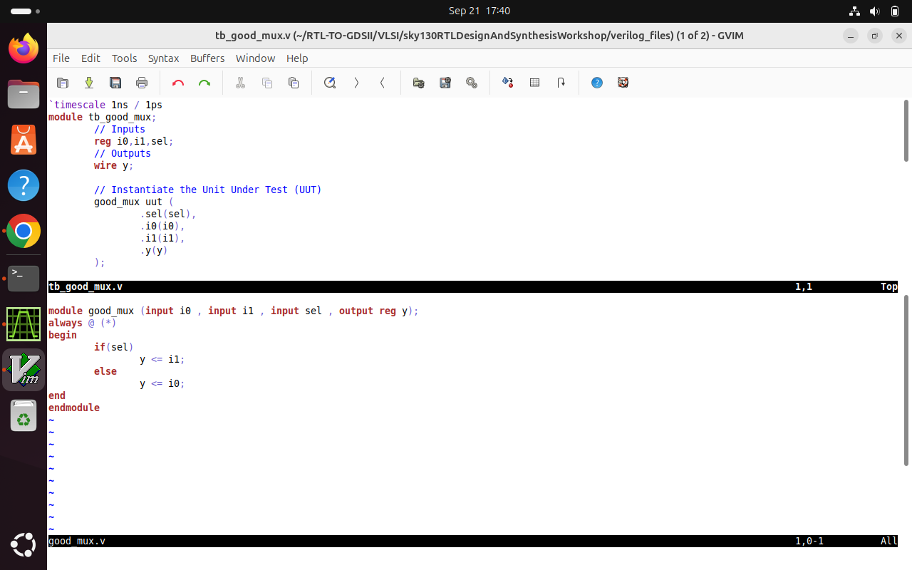

# Day 1: Introduction to Verilog RTL Design & Synthesis

Welcome to **Day 1** of the RTL Workshop!

Today, you'll learn Verilog, iverilog simulation, and Yosys synthesis.

---

## Screenshots

- 
- 
- 
- 
- 
- 
