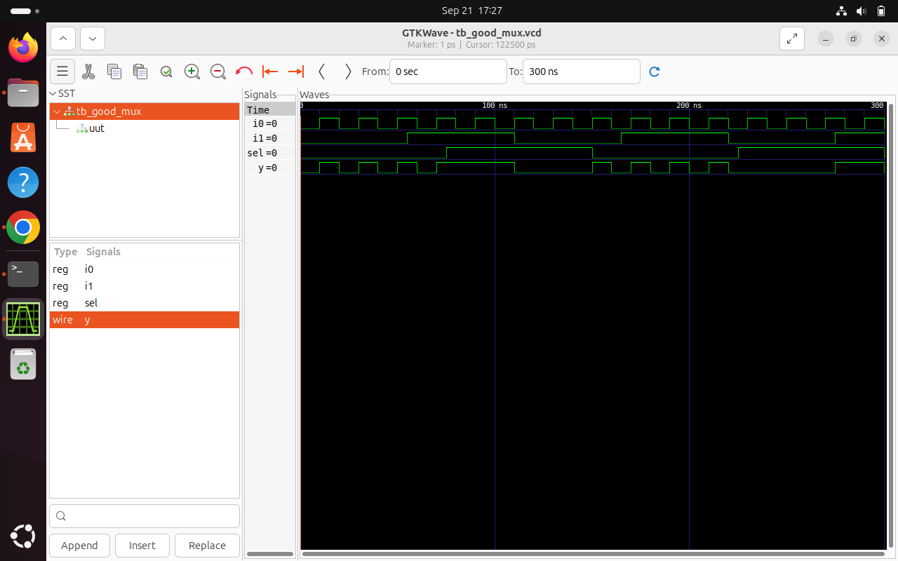

# Day 1: Introduction to Verilog RTL Design & Synthesis

Today, I began my journey into digital design by learning **Verilog**, performing simulations with *Icarus Verilog (iverilog)*, and exploring the basics of logic synthesis using **Yosys**. This day introduced me to the fundamentals of RTL (Register Transfer Level) design and gave me hands-on experience with practical labs.

---

## Table of Contents

1. [What I Learned About Simulators, Designs, and Testbenches](#1-what-i-learned-about-simulators-designs-and-testbenches)
2. [Getting Started with iverilog](#2-getting-started-with-iverilog)
3. [Lab: Simulating a 2-to-1 Multiplexer](#3-lab-simulating-a-2-to-1-multiplexer)
4. [Analyzing Verilog Code](#4-analyzing-verilog-code)
5. [Introduction to Yosys & Gate Libraries](#5-introduction-to-yosys--gate-libraries)
6. [Synthesis Lab with Yosys](#6-synthesis-lab-with-yosys)
7. [Key Takeaways and Reflections](#7-key-takeaways-and-reflections)

---

## 1. What I Learned About Simulators, Designs, and Testbenches

### Simulator
I learned that a **simulator** is a tool that checks whether my digital circuit works correctly by applying test inputs and observing outputs. Using a simulator allows me to verify functionality before moving to hardware.

### Design
I learned that the **design** is my actual Verilog code that describes the logic behavior of the circuit I want to implement.

### Testbench
I learned that a **testbench** is like a virtual environment that applies different inputs to my design and checks if the outputs match my expectations. It is essential for ensuring correctness.

<div align="center">
  
</div>

---

## 2. Getting Started with iverilog

I learned that *iverilog* is an open-source simulator for Verilog. It compiles my design and testbench into a simulation executable and produces a `.vcd` file for waveform viewing in GTKWave.

<div align="center">
  
</div>

I also learned some practical tips:
- Always keep the design and testbench in the same directory for simplicity.
- Use GTKWave to visually inspect the signals and verify behavior.

---

## 3. Lab: Simulating a 2-to-1 Multiplexer

I practiced simulating a **2-to-1 multiplexer** today.

### Step 1: Clone the Workshop Repository

```bash
git clone https://github.com/AnujLoyare/RTL-TO-GDSII.git
cd sky130RTLDesignAndSynthesisWorkshop/verilog_files
```

### Step 2: Install Required Tools
```bash
sudo apt install iverilog
sudo apt install gtkwave
```
### Step 3: Simulate the Design
```bash
iverilog good_mux.v tb_good_mux.v
./a.out
gtkwave tb_good_mux.vcd
```
<div align="center">  </div>

I learned how to interpret waveforms, check output correctness, and confirm that the multiplexer behaves as expected for all input combinations.

---

## 4. Analyzing Verilog Code
```bash
module good_mux (
    input i0,
    input i1,
    input sel,
    output reg y
);
always @ (*) begin
    if(sel)
        y <= i1;
    else 
        y <= i0;
end
endmodule
```
I learned:
How to use always @(*) blocks for combinational logic.
How conditional statements (if-else) control output signals.
The importance of reg for outputs in combinational assignments.


## 5. Introduction to Yosys & Gate Libraries

I learned that Yosys is an open-source synthesis tool that converts my Verilog code into a gate-level netlist, which represents the hardware implementation of my design.
Yosys Features I Explored:
Synthesis of HDL to logic gates.
Optimazation for speed and area.
Mapping logic to actual technology cells in a library.
Verification and visualization.
I also learned why gate libraries have different “flavors”:
Gates have different speed, power, and drive strengths.
The synthesis tool chooses the best version depending on constraints.
Understanding this helps me optimize designs for area, speed, or power.

## 6. Synthesis Lab with Yosys

I synthesized the good_mux design using Yosys:
Step-by-Step Flow

1.Start Yosys
```bash
yosys
```

2.Read the Liberty Library
```bash
read_liberty -ignore_miss_func ../lib/address/to/your/sky130/file/sky130_fd_sc_hd__tt_025C_1v80.lib
read_verilog /home/anuj-loyare/VLSI/sky130RTLDesignAndSynthesisWorkshop/verilog_files/good_mux.v
synth -top good_mux
abc -liberty /address/to/your/sky130/file/sky130_fd_sc_hd__tt_025C_1v80.lib
show
```
<div align="center">   </div>
I learned how to map my RTL to actual gates, inspect the synthesized netlist, and understand how each signal and gate is represented.
---
## 7. Key Takeaways and Reflections

I learned the difference between simulation and synthesis.
I practiced using iverilog and GTKWave to verify RTL functionality.
I explored Yosys to synthesize designs and analyze gate-level netlists.
I learned to pay attention to input/output signal naming, conditional logic, and the implications of combinational versus sequential behavior.
I gained a deeper understanding of how abstract Verilog code translates into real hardware logic.
I feel more confident now in simulating, analyzing, and synthesizing simple combinational circuits, and I am ready to move on to more complex designs in the coming days.
