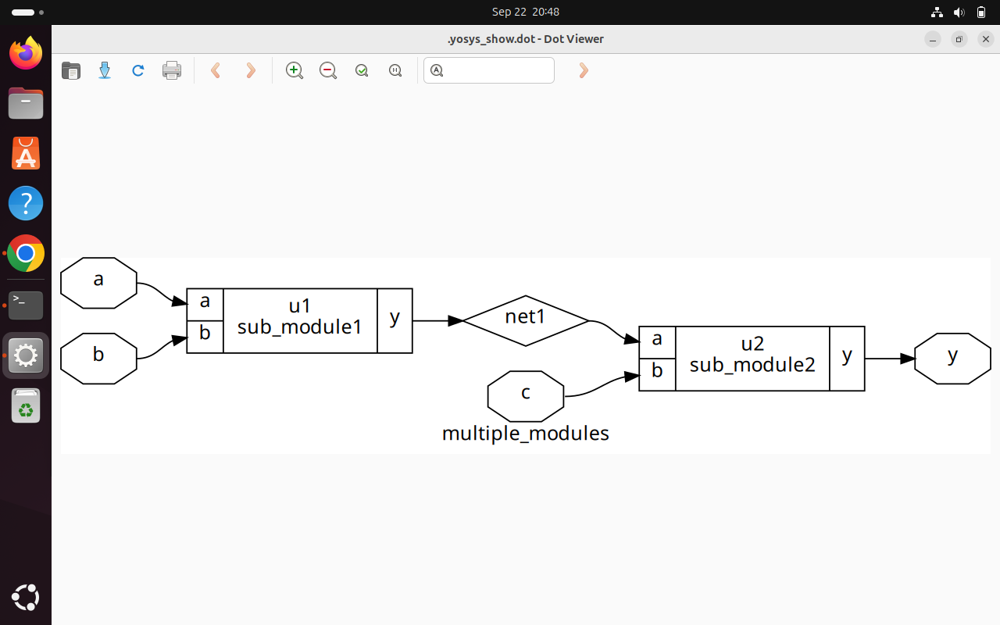
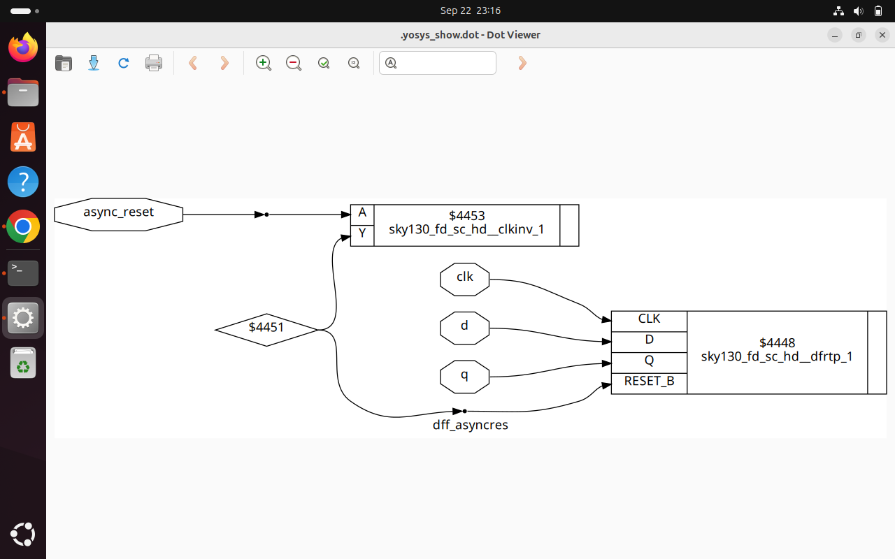

# 🚀 Day 2: Timing Libraries, Synthesis Approaches, and Efficient Flip-Flop Coding

> **Welcome to Day 2 of the RTL Workshop!** Today we'll dive deep into three fundamental aspects of digital design that form the backbone of modern IC development.

## 🎯 Learning Objectives

By the end of this session, you'll master:
- 📚 **Timing Libraries** - Understanding SKY130 PDK and `.lib` files
- 🏗️ **Synthesis Strategies** - Hierarchical vs. flat synthesis trade-offs
- ⚡ **Flip-Flop Design** - Efficient coding patterns for sequential logic

---

## 📚 Timing Libraries: Your Design Foundation

### 🌟 SKY130 PDK: The Open-Source Game Changer

The **SKY130 PDK** represents a revolutionary step in open-source IC design. Built on SkyWater Technology's proven 130nm CMOS process, it provides comprehensive models and libraries that rival proprietary solutions.

**Why SKY130 Matters:**
- 🆓 **Open Source** - No licensing fees or restrictions
- 🔬 **Industry Proven** - Based on mature 130nm technology
- 🛠️ **Complete Ecosystem** - From design to tapeout support

### 🔍 Decoding the Magic: `tt_025C_1v80`

Ever wondered what those cryptic characters mean? Let's break down the SKY130 naming convention:

```
sky130_fd_sc_hd__tt_025C_1v80.lib
                  │   │    │
                  │   │    └── Supply Voltage: 1.8V
                  │   └─────── Temperature: 25°C
                  └─────────── Process Corner: Typical-Typical
```

**Process Corner Decoded:**
- **tt** = Typical NMOS, Typical PMOS (balanced performance)
- **025C** = Room temperature operation
- **1v80** = Standard core voltage for 130nm

### 💻 Exploring the .lib File

**Quick Setup:**
```bash
sudo apt install gedit

# Open the timing library
gedit sky130_fd_sc_hd__tt_025C_1v80.lib
```

<div align="center">
  
</div>

**What You'll Find Inside:**
- ⏱️ Timing arcs and delay models
- ⚡ Power consumption data
- 📊 Process variation parameters
- 🔧 Cell characterization data

---

## 🏗️ Synthesis Strategies: Architecture Decisions That Matter

Choosing between hierarchical and flat synthesis isn't just a technical decision—it's a strategic choice that impacts your entire design flow.

### 🌳 Hierarchical Synthesis: Divide and Conquer

**The Philosophy:** Maintain your carefully crafted module boundaries and synthesize each piece independently.

```verilog
module top_module (
    input clk, reset,
    input [7:0] data_in,
    output [15:0] result
);
    
    processor_core cpu (
        .clk(clk),
        .reset(reset),
        .data(data_in),
        .output(intermediate)
    );
    
    output_stage out (
        .clk(clk),
        .data(intermediate),
        .result(result)
    );
    
endmodule
```


<div align="center">
  
</div>

<div align="center">
  
</div>

<div align="center">
  
</div>

**✅ Advantages:**
- 🚀 **Faster Compilation** - Parallel synthesis possible
- 🐛 **Better Debug** - Trace issues back to RTL modules
- 🔄 **Incremental Builds** - Resynthesize only changed modules
- 📊 **Clear Reporting** - Per-module timing and area analysis

**❌ Trade-offs:**
- 🚧 **Limited Cross-Module Optimization** - Boundaries block some optimizations
- 📈 **Potential Area Overhead** - Duplicate logic at interfaces


<div align="center">
  
</div>

### 🌊 Flattened Synthesis: Maximum Optimization

**The Philosophy:** Remove all barriers and let the synthesizer see the complete picture for aggressive optimization.

```bash
# In Yosys, flattening is simple
yosys> flatten
```


<div align="center">
  
</div>

**✅ Advantages:**
- 🎯 **Maximum Optimization** - No boundaries to limit logic sharing
- 📉 **Better Area Efficiency** - Aggressive constant propagation
- ⚡ **Optimal Critical Paths** - Cross-module timing optimization

**❌ Trade-offs:**
- 🐌 **Slower Synthesis** - Single large problem to solve
- 🔍 **Harder Debug** - Original structure lost
- 💾 **Memory Intensive** - Large designs consume significant RAM

### 📊 Quick Comparison Guide

| Factor | 🌳 Hierarchical | 🌊 Flattened |
|--------|----------------|-------------|
| **Synthesis Time** | ⚡ Fast | 🐌 Slower |
| **Debug Ease** | 😊 Easy | 😓 Challenging |
| **Optimization** | 🎯 Moderate | 🚀 Maximum |
| **Memory Usage** | 💚 Efficient | ⚠️ High |
| **Best For** | Large teams, IP reuse | Small designs, max performance |

---

## ⚡ Flip-Flop Coding: The Art of Sequential Logic

Flip-flops are the memory cells of digital systems. Getting them right is crucial for reliable, efficient designs.

### 🔄 Asynchronous Reset: Immediate Response

Perfect for system initialization and emergency shutdown scenarios.

```verilog
module dff_asyncres (
    input clk,
    input async_reset,
    input d,
    output reg q
);
    
    always @ (posedge clk, posedge async_reset) begin
        if (async_reset)
            q <= 1'b0;  
        else
            q <= d;    
    end
    
endmodule
```

**🎯 Use Cases:**
- System power-on reset
- Emergency fault conditions
- Clock domain crossing


<div align="center">
  
</div>

### ⬆️ Asynchronous Set: Power-On Defaults

Useful when you need immediate logic high states.

```verilog
module dff_async_set (
    input clk,
    input async_set,
    input d,
    output reg q
);
    
    always @ (posedge clk, posedge async_set) begin
        if (async_set)
            q <= 1'b1; 
        else
            q <= d;     
    end
    
endmodule
```
<div align="center">
  
</div>

### ⏰ Synchronous Reset: Timing-Safe Operation

Ideal for counters, state machines, and general sequential logic.

```verilog
module dff_syncres (
    input clk,
    input async_reset,
    input sync_reset,
    input d,
    output reg q
);
    
    always @ (posedge clk) begin
        if (sync_reset)
            q <= 1'b0;  
        else
            q <= d;     
    end
    
endmodule
```

**💡 Pro Tips:**
- Use async reset sparingly - only when truly needed
- Sync reset provides better timing closure
- Always consider reset release timing in clock domains


<div align="center">
  
</div>

---

## 🛠️ Simulation and Synthesis: Your Development Workflow

### 📊 Icarus Verilog: Fast and Free Simulation

```bash
# 1. Compile your design and testbench
iverilog dff_asyncres.v tb_dff_asyncres.v

# 2. Execute simulation
./a.out

# 3. Analyze results visually
gtkwave tb_dff_asyncres.vcd
```

<div align="center">
  
</div>

**🎯 Simulation Best Practices:**
- Test all reset conditions
- Verify setup/hold timing margins
- Include corner case scenarios

### ⚙️ Yosys: Open-Source Synthesis Power

```bash
# Start your synthesis session
yosys

# Load timing models
read_liberty -lib /path/to/sky130_fd_sc_hd__tt_025C_1v80.lib

# Read your RTL design
read_verilog /path/to/dff_asyncres.v

# Synthesize to generic gates
synth -top dff_asyncres

# Map sequential elements
dfflibmap -liberty /path/to/sky130_fd_sc_hd__tt_025C_1v80.lib

# Technology mapping to SKY130
abc -liberty /path/to/sky130_fd_sc_hd__tt_025C_1v80.lib

# Visualize your creation
show
```


<div align="center">
  
</div>

**🚀 Synthesis Optimization Tips:**
- Use appropriate optimization goals (`-area`, `-speed`)
- Leverage hierarchy for better QoR (Quality of Results)
- Verify functionality with post-synthesis simulation

---

## 🎓 Key Takeaways

### 📝 Essential Concepts Mastered

1. **Library Understanding**
   - SKY130 naming conventions make sense
   - Process corners affect timing and power

2. **Synthesis Strategy**
   - Hierarchical for large, modular designs
   - Flat for maximum optimization
   - Choose based on project constraints

3. **Sequential Logic Design**
   - Async reset for immediate response
   - Sync reset for timing predictability
   - Choose reset strategy early in design

---

## 💡 Pro Designer Tips

**🔥 Hot Tips from the Trenches:**

- Always simulate before and after synthesis
- Use hierarchical synthesis for IP blocks
- Document your synthesis methodology
- Leverage Yosys scripting for repeatable flows

**⚠️ Common Pitfalls to Avoid:**

- Mixing async and sync resets carelessly
- Ignoring clock domain crossing in flops
- Over-flattening complex hierarchical designs
- Forgetting to verify post-synthesis functionality

---

## 🧠 Interesting Optimization: Smart Multiplication Strategies

One of the most fascinating aspects of RTL synthesis is how tools optimize multiplication operations. Let's explore some clever optimizations that modern synthesizers employ:

### 🔢 Power-of-2 Multiplication: The Left Shift Magic

**The Insight:** Multiplying by powers of 2 is simply a left shift operation!

```verilog
// Instead of expensive multipliers, synthesizers use shifts:
assign result_mul2 = a << 1;  // Multiply by 2
assign result_mul4 = a << 2;  // Multiply by 4  
assign result_mul8 = a << 3;  // Multiply by 8
```

**Why This Matters:**
- ⚡ **Zero Latency** - Pure combinational logic
- 💾 **Minimal Area** - No multiplier blocks needed
- 🔋 **Low Power** - Just wire routing, no computation

### 🎯 Special Case: Multiply by 9 Optimization

Here's where synthesis tools get really clever! For `multiply by 9`, instead of using a full multiplier:

```verilog
// Traditional approach (expensive):
assign result = a * 9;

// Optimized synthesis approach:
// 9 = 8 + 1 = (a << 3) + a
assign result = (a << 3) + a;
```

**The Magic Behind Multiply by 9:**
- **Binary Insight**: `9 = 1001₂ = 8 + 1`
- **Optimization**: `a × 9 = a × (8 + 1) = (a << 3) + a`
- **Hardware**: One shifter + one adder instead of multiplier

### 🏗️ Bit-width Optimization Example

Consider this interesting case you observed:

```verilog
// For a 3-bit input (bits 2:0), multiply by 9
module smart_mul9 (
    input [2:0] a,      // 3-bit input
    output [5:0] y      // 6-bit output (3+3=6 bits max)
);
    
    // Synthesis optimization:
    // y[5:0] = a[2:0] × 9
    // y[5:0] = (a[2:0] << 3) + a[2:0]
    assign y = {a, 3'b000} + {3'b000, a};
    
endmodule
```

**Bit-wise Breakdown:**
```
Original:  a[2:0] = abc (binary)
Shift <<3: a[5:3] = abc000  
Add orig:  a[2:0] = 000abc
Result:    y[5:0] = abcabc (where the addition creates the mul-by-9)
```

### 🎨 Synthesis Tool Intelligence

Modern synthesis tools automatically recognize these patterns:

```verilog
// All of these get optimized automatically:
assign mul2  = data * 2;   // → data << 1
assign mul4  = data * 4;   // → data << 2  
assign mul8  = data * 8;   // → data << 3
assign mul16 = data * 16;  // → data << 4

// Even complex cases:
assign mul9  = data * 9;   // → (data << 3) + data
assign mul10 = data * 10;  // → (data << 3) + (data << 1)
assign mul12 = data * 12;  // → (data << 3) + (data << 2)
```

### 💡 Design Implications

**For RTL Designers:**
- Trust your synthesizer for common multiplications
- Explicitly use shifts when timing is critical
- Consider bit-width carefully to avoid overflow

**For Verification:**
- Test edge cases (maximum input values)
- Verify overflow behavior matches specification
- Check that optimizations preserve functionality

**Hardware Efficiency:**
- Powers of 2: Nearly free (just routing)
- Sum of powers of 2: One adder per term
- General multiplication: Full multiplier required

This optimization showcases the intelligence built into modern synthesis tools and why understanding both RTL and hardware implementation is crucial for effective digital design!
---

*Ready to dive deeper? The next workshop session will cover advanced timing analysis and clock domain crossing techniques!*

