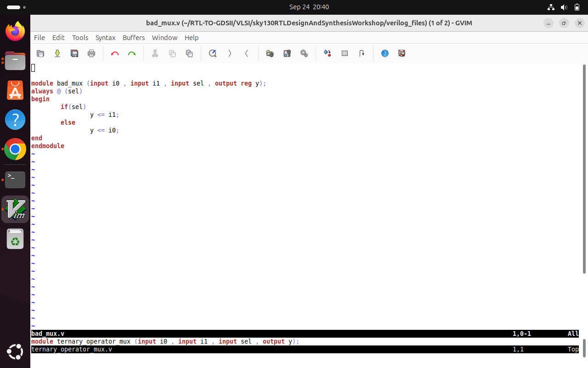

# Introduction Gate Level Simulation(GLS) & Synthesis Simulation Mismatches

Welcome to Day 4 of the RTL Workshop! Today we dive deep into the fascinating world of Gate-Level Simulation and uncover the mysteries behind Synthesis-Simulation Mismatches. Get ready to master the art of verification and learn how to avoid the common traps that can make your RTL behave differently than your hardware!

---
## Table of Contents

- [1. What is Gate-Level Simulation (GLS)?](#1-what-is-gate-level-simulation-gls)
- [2. Why is GLS Used?](#2-why-is-gls-used)
- [3. Synthesis-Simulation Mismatch](#3-synthesis-simulation-mismatch)
  - [3.1 Missing Sensitivity List](#31-missing-sensitivity-list)
  - [3.2 Blocking vs Non-Blocking Assignments](#32-blocking-vs-non-blocking-assignments)
  - [3.3 Non-Standard Verilog Coding](#33-non-standard-verilog-coding)
- [4. Labs and Examples](#4-labs-and-examples)
- [5. Summary](#5-summary)

---

## 1. What is Gate-Level Simulation (GLS)?

**Gate-Level Simulation (GLS)** is a critical verification step in the VLSI design flow where the synthesized gate-level netlist of a digital circuit is simulated using the actual gate-level primitives and their associated timing information.

In GLS, instead of simulating the high-level RTL (Register Transfer Level) description, we simulate the actual gates, flip-flops, and other primitive elements that the synthesis tool has mapped our design to. This provides a more accurate representation of how the design will behave in actual hardware.

### Key Characteristics of GLS:
- **Gate-level representation**: Uses actual technology library gates
- **Timing accurate**: Incorporates real gate delays and setup/hold times
- **Technology specific**: Results depend on the target technology library
- **Post-synthesis verification**: Performed after RTL synthesis is complete

---

## 2. Why is GLS Used?

Gate-Level Simulation serves several critical purposes in the digital design flow:

### 2.1 Synthesis Validation
- **Functional verification**: Ensures that synthesis tools correctly translate RTL into equivalent gate-level logic
- **Logic optimization verification**: Confirms that synthesis optimizations don't alter intended functionality
- **Technology mapping validation**: Verifies proper mapping to target technology library

### 2.2 Timing Verification
- **Real delay simulation**: Uses actual gate delays from technology libraries (SDF - Standard Delay Format)
- **Setup/hold checking**: Identifies potential timing violations in sequential elements
- **Clock domain analysis**: Verifies proper timing relationships across different clock domains
- **Critical path analysis**: Helps identify timing bottlenecks in the design

### 2.3 Testability Verification
- **DFT validation**: Confirms that Design for Test (DFT) structures like scan chains work correctly post-synthesis
- **ATPG compatibility**: Ensures compatibility with Automatic Test Pattern Generation tools
- **Fault coverage**: Validates that test patterns can effectively detect manufacturing defects

### 2.4 Power Analysis
- **Dynamic power estimation**: More accurate power consumption analysis using actual gate switching
- **Leakage analysis**: Static power consumption based on actual technology characteristics

### 2.5 Early Problem Detection
- **Pre-layout verification**: Catches issues before time-consuming physical design steps
- **Cost reduction**: Fixes issues early in the design flow when changes are less expensive
- **Risk mitigation**: Reduces the risk of silicon respins

---

## 3. Synthesis-Simulation Mismatch

A **synthesis-simulation mismatch** occurs when the behavior observed in RTL simulation differs from the behavior of the synthesized gate-level netlist or actual hardware. Understanding and preventing these mismatches is crucial for successful digital design.

## 3.1 Missing Sensitivity List

One of the most common causes of synthesis-simulation mismatch is an **incomplete sensitivity list** in combinational logic blocks.

### The Problem:
When the sensitivity list of an `always` block doesn't include all the signals that the logic depends on, simulation behavior may not match synthesis results.

### Example: Bad MUX with Missing Sensitivity List

```verilog
module bad_mux (input i0, input i1, input sel, output reg y);
  always @ (sel) begin  // Missing i0 and i1 in sensitivity list
    if (sel)
      y <= i1;
    else 
      y <= i0;
  end
endmodule
```

<div align="center">
  
</div>

**Issues with this code:**
- Sensitivity list only includes `sel`, but logic also depends on `i0` and `i1`
- In simulation, output `y` won't update when `i0` or `i1` change (unless `sel` also changes)
- Synthesis tools will create combinational logic that responds to all inputs
- This creates a mismatch between simulation and synthesized hardware behavior

### Corrected Version:
```verilog
module good_mux (input i0, input i1, input sel, output reg y);
  always @ (*) begin  // Complete sensitivity list using wildcard
    if (sel)
      y = i1;  // Using blocking assignment for combinational logic
    else 
      y = i0;
  end
endmodule
```

<div align="center">
  
</div>

## 3.2 Blocking vs Non-Blocking Assignments

The choice between blocking (`=`) and non-blocking (`<=`) assignments significantly impacts both simulation behavior and synthesis results.

### Blocking Assignments (`=`)
- **Execution**: Sequential, executes immediately in the order written
- **Use case**: Combinational logic in `always @(*)` blocks
- **Synthesis**: Creates combinational logic paths
- **Timing**: No clock dependency

### Non-Blocking Assignments (`<=`)
- **Execution**: Concurrent, all assignments execute simultaneously at the end of the time step
- **Use case**: Sequential logic in `always @(posedge clk)` blocks
- **Synthesis**: Creates flip-flops and registered logic
- **Timing**: Clock-dependent updates

### Comparison Table

| **Blocking (`=`)**                        | **Non-Blocking (`<=`)**                   |
|-------------------------------------------|--------------------------------------------|
| Uses `=` operator                         | Uses `<=` operator                         |
| Sequential, immediate execution           | Concurrent, scheduled execution            |
| Updates happen instantly in code order    | Updates applied after time step            |
| For combinational logic                   | For sequential logic (registers/flip-flops)|
| Infers combinational logic (gates)        | Infers sequential logic (flip-flops)      |
| Can cause race conditions if misused      | Eliminates race conditions in clocked logic|

### Example: Blocking Assignment Caveat

```verilog
module blocking_caveat (input a, input b, input c, output reg d);
  reg x;
  always @ (*) begin
    d = x & c;  // Uses OLD value of x
    x = a | b;  // x gets updated AFTER d is computed
  end
endmodule
```

<div align="center">
  
</div>


**Problem**: The order of blocking assignments matters. Here, `d` uses the previous value of `x`, not the newly computed value.

**Corrected Version:**
```verilog
module blocking_caveat_fixed (input a, input b, input c, output reg d);
  reg x;
  always @ (*) begin
    x = a | b;  // Compute x first
    d = x & c;  // Then use updated x value
  end
endmodule
```

<div align="center">
  
</div>

## 3.3 Non-Standard Verilog Coding

Non-standard or poor Verilog coding practices can lead to synthesis-simulation mismatches and unpredictable hardware behavior.

### Common Non-Standard Practices:

#### 3.3.1 Mixed Assignment Types in Same Block
```verilog
// BAD: Mixing blocking and non-blocking in same always block
always @(posedge clk) begin
  q1 <= d1;    // Non-blocking (good for sequential)
  q2 = d2;     // Blocking (bad for sequential logic)
end
```

#### 3.3.2 Using Delays in Synthesizable Code
```verilog
// BAD: Delays are not synthesizable
always @(posedge clk) begin
  #5 q <= d;  // Delay will be ignored by synthesis
end
```

#### 3.3.3 Incomplete Case Statements
```verilog
// BAD: Missing default case can create latches
always @(*) begin
  case (sel)
    2'b00: y = a;
    2'b01: y = b;
    // Missing cases 2'b10 and 2'b11 - creates unwanted latches
  endcase
end
```

**Corrected Version:**
```verilog
always @(*) begin
  case (sel)
    2'b00: y = a;
    2'b01: y = b;
    2'b10: y = c;
    default: y = d;  // Covers remaining cases
  endcase
end
```

#### 3.3.4 Using Initial Blocks in Synthesizable Code
```verilog
// BAD: Initial blocks are not synthesizable
initial begin
  reset = 1'b0;  // This won't exist in hardware
end
```

---

## 4. Labs and Examples

### Lab 1: Ternary Operator MUX

A simple 2:1 multiplexer using a ternary operator:

```verilog
module ternary_operator_mux (input i0, input i1, input sel, output y);
  assign y = sel ? i1 : i0;
endmodule
```

<div align="center">
  
</div>

### Lab 2: Synthesis Using Yosys

Synthesis of the MUX using Yosys synthesis tool:

<div align="center">
  
</div>

### Lab 3: Gate-Level Simulation

GLS command for the synthesized MUX:
```shell
iverilog /path/to/primitives.v /path/to/sky130_fd_sc_hd.v ternary_operator_mux.v testbench.v
```

<div align="center">
  
</div>

### Lab 4: Bad MUX GLS

Gate-level simulation of the problematic MUX design:

<div align="center">
  
</div>

### Lab 5: Blocking Caveat Synthesis

Synthesis results for the blocking assignment caveat example:

<div align="center">
  
</div>

---

## 5. Summary

### Key Takeaways:

1. **Gate-Level Simulation is Essential**:
   - Validates synthesis correctness
   - Provides timing-accurate simulation
   - Catches issues early in the design flow
   - Ensures testability and manufacturability

2. **Synthesis-Simulation Mismatches Can Be Avoided**:
   - Use complete sensitivity lists (`always @(*)` for combinational logic)
   - Follow proper assignment guidelines (blocking for combinational, non-blocking for sequential)
   - Avoid non-standard Verilog coding practices
   - Always include default cases in case statements

3. **Best Practices**:
   - Write synthesizable, unambiguous RTL code
   - Use blocking assignments (`=`) for combinational logic
   - Use non-blocking assignments (`<=`) for sequential logic
   - Always simulate both RTL and gate-level netlists
   - Review synthesis warnings and fix coding issues

4. **Verification Strategy**:
   - Perform RTL simulation first
   - Run synthesis and check for warnings
   - Perform GLS with the same testbenches
   - Compare RTL and GLS results
   - Investigate any mismatches thoroughly

---

> [!TIP]
> Always simulate both your RTL and gate-level netlist using the same testbenches, and carefully review all warnings from synthesis and simulation tools! A clean synthesis with no warnings significantly reduces the risk of synthesis-simulation mismatches.

---
