# Day 1: Circuit Design & SPICE Simulation

## Table of Contents
1. [Introduction to Circuit Design](#introduction-to-circuit-design)
2. [Delay Table Analysis](#delay-table-analysis)
3. [NMOS Fundamentals](#nmos-fundamentals)
4. [SPICE Simulation Basics](#spice-simulation-basics)
5. [Lab Session](#lab-session)
6. [Results and Observations](#results-and-observations)

---

## Introduction to Circuit Design
## CMOS
CMOS (Complementary Metal-Oxide-Semiconductor) technology forms the backbone of modern digital integrated circuits. Understanding transistor-level behavior is crucial for:
- Accurate timing analysis in STA (Static Timing Analysis)
- Predicting circuit delay and performance
- Managing power consumption
- Handling process, voltage, and temperature (PVT) variations

This workshop explores the physical characteristics of MOSFETs using the **SKY130 PDK** (Process Design Kit) and SPICE simulations.

---

## Delay Table Analysis

### Level 2 Buffer Circuit

<div align="center">
  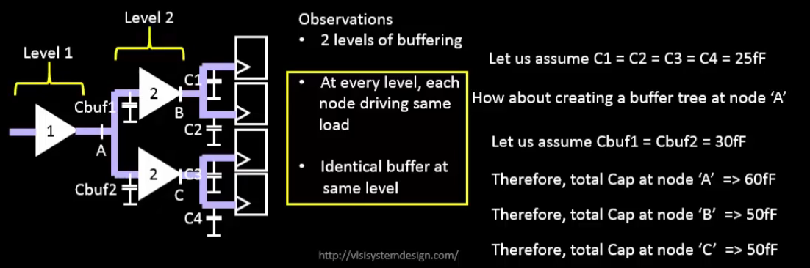
</div>

In digital circuits, buffers are commonly used to drive large capacitive loads. We analyzed a **2 level-buffer chain** to understand:

- **Delay propagation** through cascaded stages
- **Input-to-output timing relationships**
- **Load-dependent delay variations**

**Key Observations from Delay Tables:**
- Delay increases with output load capacitance
- Input slew (transition time) affects output delay
- Each buffer stage contributes to total propagation delay
- Non-linear relationship between input slew and output delay

<div align="center">
  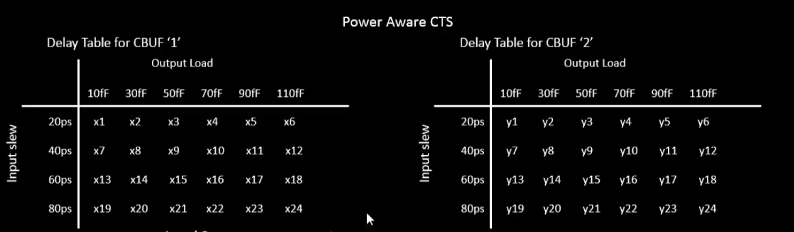
</div>

---

## NMOS Fundamentals

### NMOS 4-Terminal Device

An NMOS transistor has **four terminals**:

1. **Gate (G)**: Controls the channel conductivity
2. **Drain (D)**: Carrier collection terminal
3. **Source (S)**: Carrier injection terminal
4. **Body/Bulk (B)**: Substrate connection (typically tied to ground for NMOS)

<div align="center">
  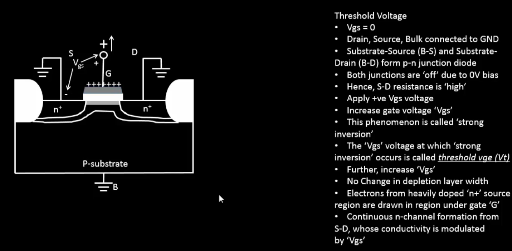
</div>

---

### Threshold Voltage (Vth)

**Threshold voltage (Vth)** is the minimum gate-to-source voltage required to create a conducting channel between source and drain.

**Formula:**
```
Vth = Vth0 + γ(√|1-2φF + Vsb| - √|1-2φF|)
```

Where:
- **Vth0**: Threshold voltage at zero body bias
- **γ (gamma)**: Body effect coefficient
- **φF**: Fermi potential
- **Vsb**: Source-to-body voltage

**Body Effect (Vbs):**
- When Vsb ≠ 0, the threshold voltage increases
- Important in series-connected transistors
- Affects circuit speed and noise margins
- 
<div align="center">
  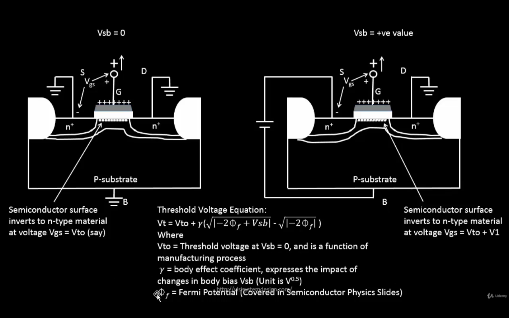
</div>

<div align="center">
  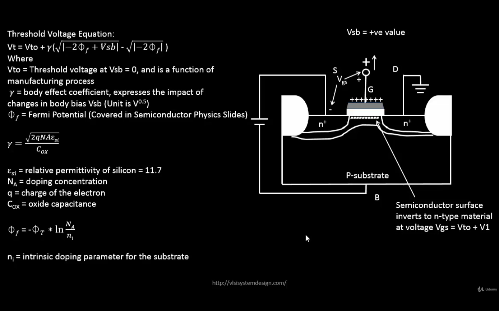
</div>

---

### Operating Regions

#### 1. **Cutoff Region** (Vgs < Vth)
- No channel formation
- Ids ≈ 0 (only leakage current)
- Transistor is OFF

#### 2. **Resistive/Linear/Triode Region** (Vgs > Vth and Vds < Vgs - Vth)

<div align="center">
  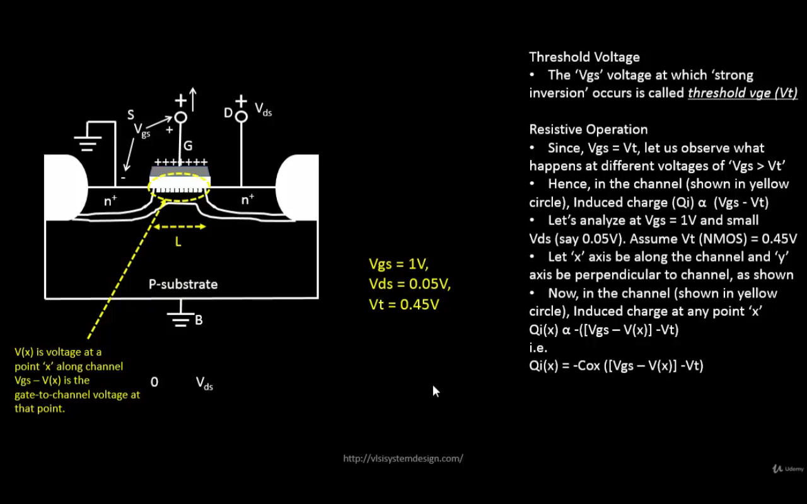
</div>

**Current Components:**

**a) Drift Current:**
- Caused by electric field between drain and source
- Dominant component in resistive region
- Proportional to (Vgs - Vth)

**Formula:**
```
Ids(drift) = μn * Cox * (W/L) * [(Vgs - Vth) * Vds - Vds²/2]
```

**b) Diffusion Current:**
- Caused by carrier concentration gradient
- Significant in weak inversion
- Important for subthreshold operation

The transistor acts as a **voltage-controlled resistor** in this region:
```
Rds ≈ 1 / [μn * Cox * (W/L) * (Vgs - Vth)]
```
<div align="center">
  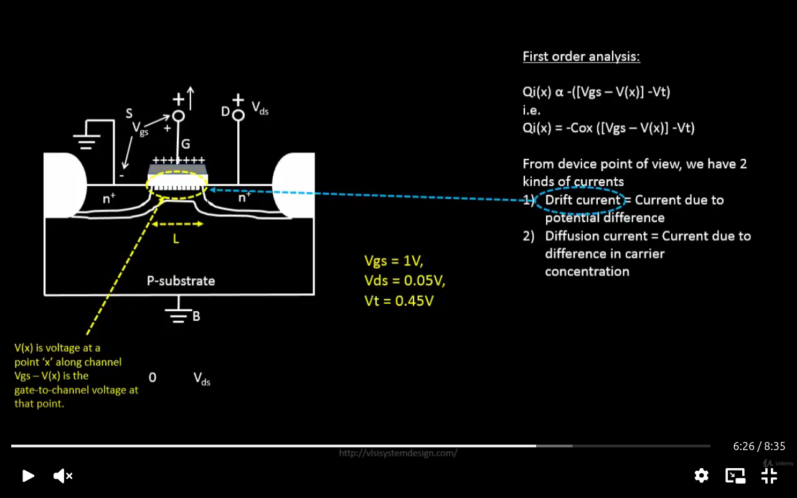
</div>

#### 3. **Saturation Region** (Vgs > Vth and Vds ≥ Vgs - Vth)

<div align="center">
  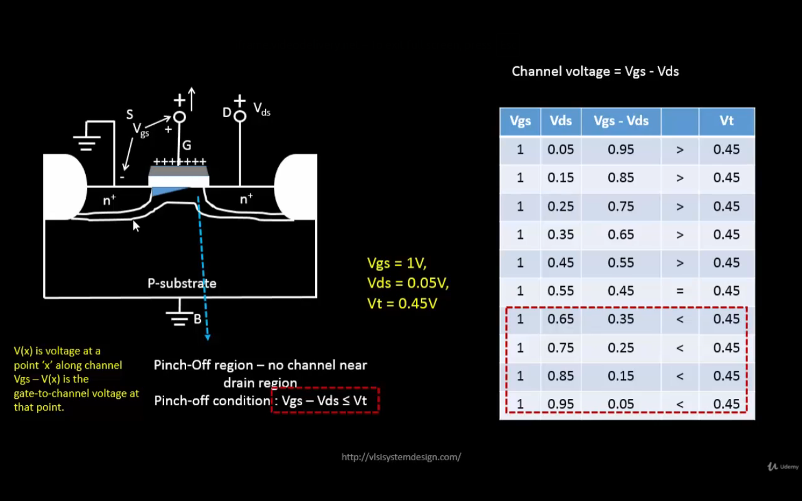
</div>

**Characteristics:**
- Channel pinches off at drain end
- Ids becomes relatively independent of Vds
- Used for analog amplification and digital switching

**Saturation Current:**
```
Ids(sat) = (1/2) * μn * Cox * (W/L) * (Vgs - Vth)² * (1 + λ*Vds)
```

Where:
- **μn**: Electron mobility
- **Cox**: Gate oxide capacitance per unit area
- **W/L**: Width-to-length ratio
- **λ**: Channel length modulation parameter

**Velocity Saturation Effects:**
- In short-channel devices (L < 0.5 μm), carrier velocity saturates
- Ids becomes proportional to (Vgs - Vth) instead of (Vgs - Vth)²
- Reduces transconductance (gm)

---

## SPICE Simulation Basics

### Introduction to SPICE

**SPICE** (Simulation Program with Integrated Circuit Emphasis) is an industry-standard tool for analog circuit simulation.

**Key Features:**
- DC analysis (operating point, sweep)
- Transient analysis (time-domain behavior)
- AC analysis (frequency response)
- Device model support (BSIM, PSP, etc.)

---

### SKY130 SPICE Model Parameters

The **SKY130 PDK** provides detailed SPICE models for different corners and device types.

**Important Model Files:**
- `sky130_fd_pr__nfet_01v8__tt.pm3.spice`: Typical-typical NMOS model
- `sky130_fd_pr__pfet_01v8__tt.pm3.spice`: Typical-typical PMOS model
- `sky130.lib.spice`: Master library file with corner definitions

**Key Parameters in SKY130 Models:**

<div align="center">
  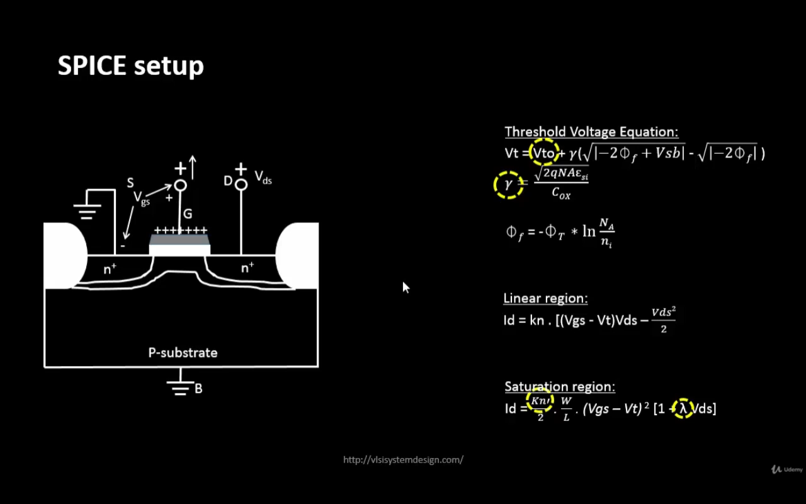
</div>


**Process Corners:**
- **TT** (Typical-Typical): Nominal process
- **FF** (Fast-Fast): Fast NMOS, fast PMOS
- **SS** (Slow-Slow): Slow NMOS, slow PMOS
- **SF** (Slow-Fast): Slow NMOS, fast PMOS
- **FS** (Fast-Slow): Fast NMOS, slow PMOS

---

### SPICE Netlist Structure

A basic SPICE netlist consists of:

```spice
* Title Line
* Component Definitions
Mname Drain Gate Source Bulk ModelName W=<width> L=<length>

* Voltage/Current Sources
Vname node+ node- DC <value>

* Analysis Commands
.dc <source> <start> <stop> <step>
.tran <tstep> <tstop>

* Control Statements
.control
run
plot <signal>
.endc

* Model/Library Inclusion
.lib "<path_to_library>" <corner>

.end
```

---

## Lab Session

### Environment Setup

```bash
# Clone the GitHub repository
git clone https://github.com/kunalg123/sky130CircuitDesignWorkshop.git

# Navigate into the directories
cd sky130CircuitDesignWorkshop
cd sky130_fd_pr
cd cells

# List available cells (nfet and pfet)
ls
```

**Output:**
```
nfet_01v8  nfet_01v8_lvt  pfet_01v8  pfet_01v8_lvt  pfet_01v8_hvt
```

---

### Exploring NMOS Model Files

```bash
# Move into nfet directory
cd nfet_01v8
ls

# View the model parameter files
less sky130_fd_pr__nfet_01v8__tt.pm3.spice
less sky130_fd_pr__nfet_01v8__tt.corner.spice
```

**Key Contents of Model File:**
```spice
.model sky130_fd_pr__nfet_01v8__tt.pm3 nmos
+ level = 54
+ version = 4.5
+ toxe = 4.148e-009
+ vth0 = 0.42
+ u0 = 0.0537
+ lint = 1.5e-008
+ ...
```

---

### Viewing Master Library File

```bash
# Move to model directory
cd ../../models
ls

# View the main library file (contains library files for nfet, pfet of different corners)
less sky130.lib.spice
```

**Library Structure:**
```spice
* SKY130 SPICE Models
.lib tt
.include "../cells/nfet_01v8/sky130_fd_pr__nfet_01v8__tt.corner.spice"
.include "../cells/pfet_01v8/sky130_fd_pr__pfet_01v8__tt.corner.spice"
.endl tt

.lib ff
...
.endl ff
```

---

### Running SPICE Simulation

```bash
# Go back to the main tools directory
cd ../../
ls

# Open the netlist file in gvim (for editing)
gvim day1_nfet_idvds_L025_W065.spice
```

**Example Netlist: `day1_nfet_idvds_L025_W065.spice`**

```spice
* NMOS Id vs Vds Characteristics
* L = 0.25um, W = 0.65um

.lib "../sky130_fd_pr/models/sky130.lib.spice" tt

* Instantiate NMOS
M1 vdd n1 0 0 sky130_fd_pr__nfet_01v8 W=0.65 L=0.25

* Voltage sources
Vdd vdd 0 1.8
Vgs n1 0 1.8

* DC Sweep Analysis
.dc Vdd 0 1.8 0.01 Vgs 0 1.8 0.2

* Control block
.control
run
display
setplot dc1
plot -vdd#branch
.endc

.end
```

---

### Execute Simulation

```bash
# Run ngspice simulation
ngspice day1_nfet_idvds_L025_W065.spice
```

**NGSpice Terminal Output:**
```
Circuit: NMOS Id vs Vds Characteristics

Doing analysis at TEMP = 27.000000 and TNOM = 27.000000

Initial Transient Solution
--------------------------
...

DC sweep analysis completed.
```

---

### Plotting Results

Inside NGSpice prompt:

```bash
# Plot branch current (Ids)
plot -vdd#branch
```

**Interactive Plot Controls:**
- **Left-click** on plot window to read cursor values
- **x-axis**: Vds (drain-to-source voltage)
- **y-axis**: Ids (drain current)
- Multiple curves for different Vgs values

---
<div align="center">
  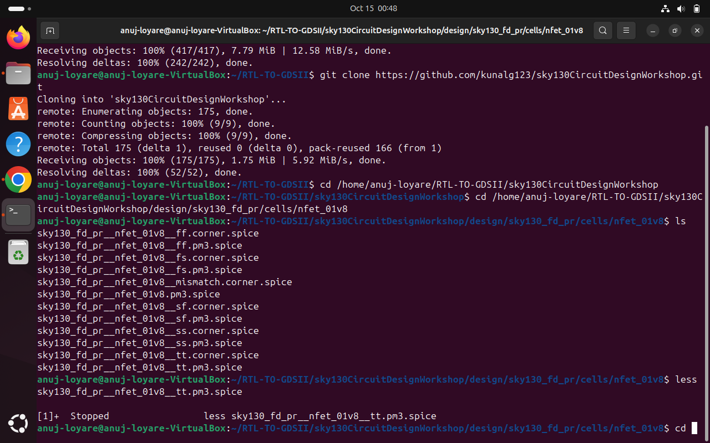
</div>

<div align="center">
  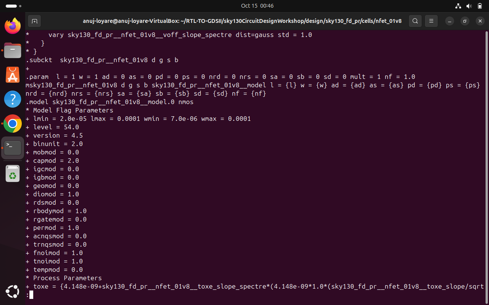
</div>
<div align="center">
  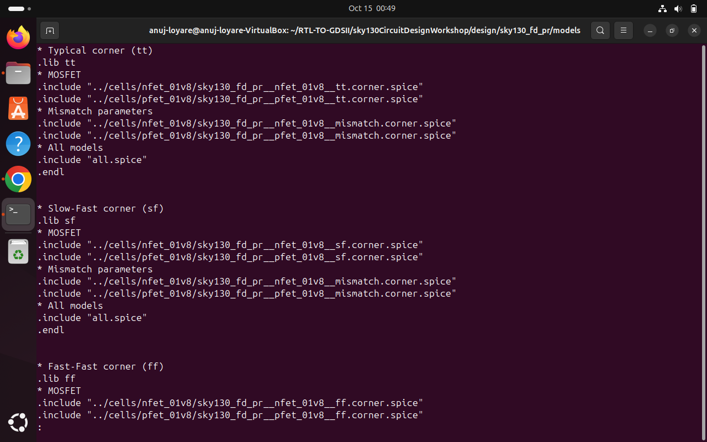
</div>
<div align="center">
  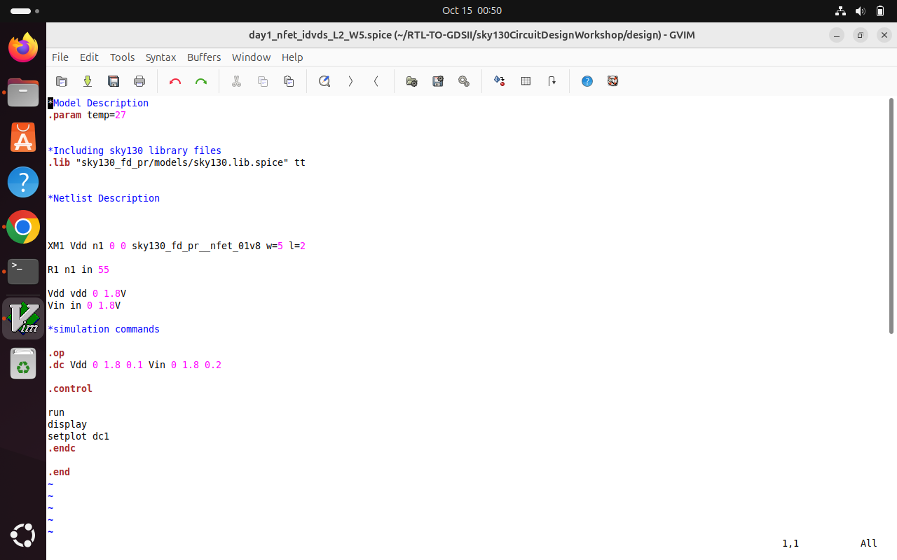
</div>
<div align="center">
  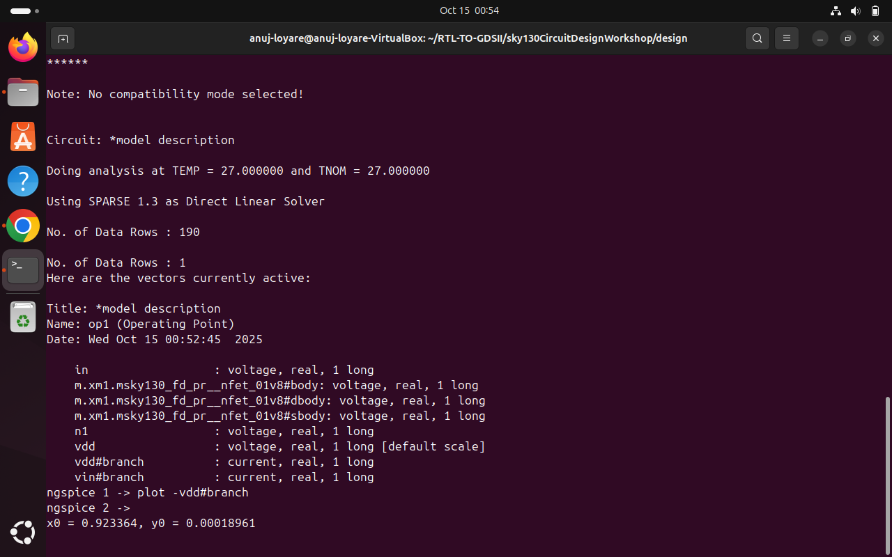
</div>
<div align="center">
  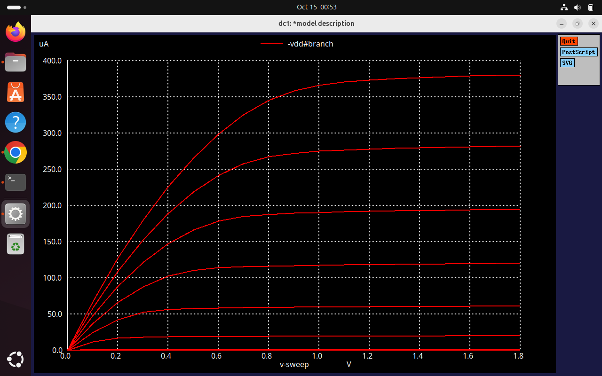
</div>
<div align="center">
  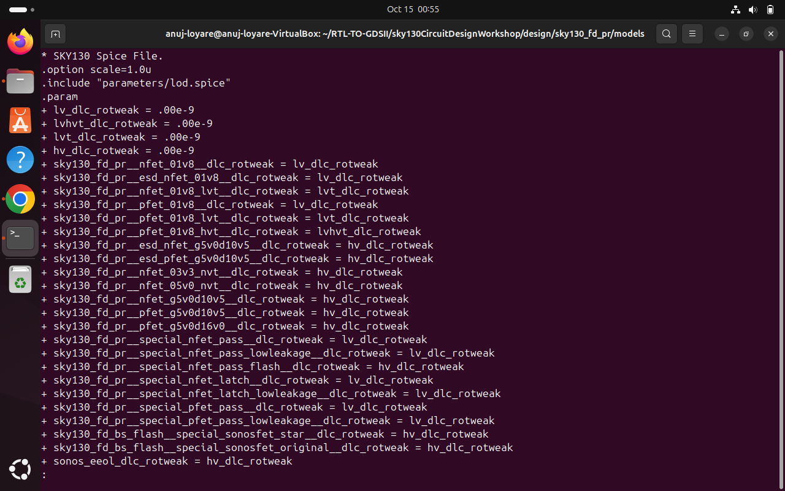
</div>

### Connection to STA Concepts

**How Transistor Behavior Affects Timing:**

1. **Delay Models:**
   - STA uses delay tables based on input slew and output load
   - These tables are derived from SPICE characterization
   - Non-linear Id-Vds curves → non-linear delay vs. load

2. **Variation Impact:**
   - Process variation changes Vth, μn, Cox
   - Affects saturation current → changes switching speed
   - STA models this through corner analysis (FF, SS, TT)

3. **Noise Margins:**
   - Determined by VTC (Voltage Transfer Characteristic)
   - VTC shape depends on transistor saturation behavior
   - Lower Ids → slower switching → reduced noise immunity

4. **Power-Performance Tradeoff:**
   - Higher Vdd → larger Vgs - Vth → more current → faster switching
   - But also increases dynamic and leakage power
   - STA must verify timing across operating voltage range

---

## Conclusions

### Key Takeaways from Day 1:

1. **MOSFET Physics Foundations:**
   - Understanding the 4-terminal structure and threshold voltage is fundamental
   - Body effect influences Vth in real circuits
   - Operating regions (cutoff, linear, saturation) determine circuit behavior

2. **Current Flow Mechanisms:**
   - Drift current dominates in strong inversion
   - Diffusion current important in subthreshold region
   - Velocity saturation in short-channel devices affects performance scaling

3. **SPICE as a Design Tool:**
   - Industry-standard simulation for circuit verification
   - SKY130 models provide realistic device behavior
   - Id-Vds characterization is the starting point for all timing analysis

4. **Link to STA:**
   - Transistor-level delays aggregate to path delays in STA
   - Variation at device level propagates to timing uncertainty
   - Understanding physics helps debug timing violations


## References

1. SKY130 PDK Documentation: [https://github.com/google/skywater-pdk](https://github.com/google/skywater-pdk)
2. Kunal Ghosh Sky130 Workshop: [https://github.com/kunalg123/sky130CircuitDesignWorkshop/](https://github.com/kunalg123/sky130CircuitDesignWorkshop/)

---

**Author**: [Anuj Loyare]  
**Date**: October 19, 2025  
**Workshop**: SKY130 CMOS Circuit Design & SPICE Simulation
