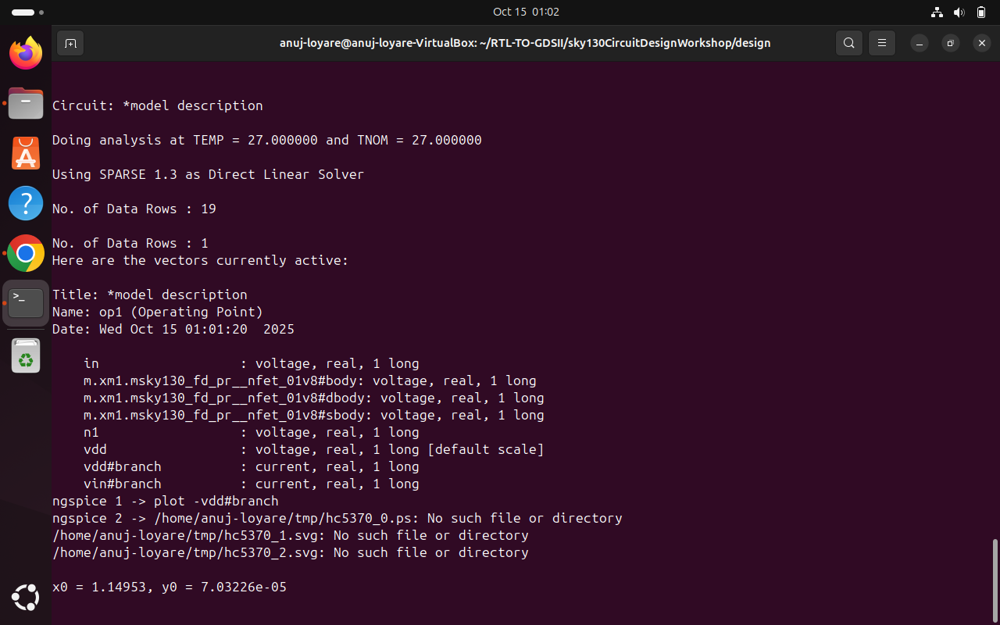

# Day 2: Velocity Saturation Effects & NMOS Characterization

## Table of Contents
1. [Introduction](#introduction)
2. [Theoretical Background](#theoretical-background)
3. [Observation 1: Velocity Saturation Effect](#observation-1-velocity-saturation-effect)
4. [Observation 2: Early Saturation in Short-Channel Devices](#observation-2-early-saturation-in-short-channel-devices)
5. [Lab Session](#lab-session)
6. [Results and Analysis](#results-and-analysis)
7. [Conclusions](#conclusions)

---

## Introduction

Day 2 focuses on understanding **velocity saturation effects** in MOSFETs, particularly how device dimensions (W/L ratios) influence the current-voltage characteristics. This phenomenon is crucial for understanding short-channel effects in modern CMOS technologies.

**Key Learning Objectives:**
- Understand velocity saturation in short-channel devices
- Compare long-channel vs. short-channel NMOS behavior
- Analyze the transition from quadratic to linear Id-Vgs dependency
- Extract device characteristics using SPICE simulations

---

## Theoretical Background

### Long-Channel vs. Short-Channel Behavior

#### **Long-Channel Devices (L > 1 μm)**

In long-channel MOSFETs, the drain current in saturation follows the **square-law model**:

```
Ids = (1/2) * μn * Cox * (W/L) * (Vgs - Vth)²
```

**Characteristics:**
- **Quadratic dependency** of Ids on (Vgs - Vth)
- Carrier velocity increases linearly with electric field
- Mobility (μn) remains constant
- Valid for E-field < 10⁴ V/cm

#### **Short-Channel Devices (L < 0.5 μm)**

In short-channel devices, high lateral electric fields cause **velocity saturation**:

```
Ids = W * Cox * vsat * (Vgs - Vth)
```

Where **vsat** is the saturation velocity (~10⁷ cm/s for silicon).

**Characteristics:**
- **Linear dependency** of Ids on (Vgs - Vth) at high Vgs
- Carrier velocity saturates at vsat
- Effective mobility decreases
- Transition from quadratic to linear behavior

---

### Velocity Saturation Physics

**Electric Field and Carrier Velocity Relationship:**

```
v = μ * E              (for low E-fields, E < Ecrit)
v → vsat               (for high E-fields, E > Ecrit)
```

Where:
- **Ecrit** ≈ 1-2 × 10⁴ V/cm (critical electric field)
- **vsat** ≈ 10⁷ cm/s for electrons in silicon

**Why Velocity Saturates:**
- At high electric fields, carriers undergo frequent scattering with optical phonons
- Energy gained from E-field is quickly lost to the lattice
- Velocity reaches a maximum (saturation) value

**Impact on Device Performance:**
- Reduces transconductance (gm)
- Causes early saturation (lower saturation voltage)
- Affects delay and switching speed
- Becomes dominant in sub-micron technologies

---

## Observation 1: Velocity Saturation Effect

<div align="center">
  
</div>

### Device Comparison Study

We compared two NMOS devices with different dimensions to observe velocity saturation effects:

| Device | Width (W) | Length (L) | W/L Ratio | Channel Type |
|--------|-----------|------------|-----------|--------------|
| **Device 1** | 1.8 μm | 1.2 μm | 1.5 | Long-channel |
| **Device 2** | 0.375 μm | 0.250 μm | 1.5 | Short-channel |

**Note:** Both devices have the same W/L ratio but different absolute dimensions.

---

### Device 1: Long-Channel Behavior (W=1.8μm, L=1.2μm)

**Expected Behavior:**
- Classical square-law model applies
- Ids ∝ (Vgs - Vth)² throughout the entire saturation region

**Observed Characteristics:**

```
Region: Saturation (Vds > Vgs - Vth)

Ids = (1/2) * μn * Cox * (1.8/1.2) * (Vgs - Vth)²
    = 0.75 * μn * Cox * (Vgs - Vth)²
```

**Id vs Vgs Plot Analysis:**
- **Quadratic dependency** maintained across all Vgs values
- Log(Ids) vs Vgs shows slope ≈ 2 in strong inversion
- No velocity saturation effects observed
- Mobility remains constant (μn ≈ 400-500 cm²/V·s)


**Observation:** √Ids increases linearly with Vgs, confirming quadratic Ids-Vgs relationship.

---

### Device 2: Short-Channel Behavior (W=0.375μm, L=0.250μm)

**Expected Behavior:**
- Velocity saturation effects at high Vgs
- Transition from quadratic to linear dependency
- Early saturation due to high lateral E-field

**Observed Characteristics:**

**Low Vgs Region (Vgs < 1.0V):**
```
Ids ≈ (1/2) * μn * Cox * (0.375/0.250) * (Vgs - Vth)²
    ≈ 0.75 * μn * Cox * (Vgs - Vth)²  (quadratic)
```

**High Vgs Region (Vgs > 1.0V):**
```
Ids ≈ W * Cox * vsat * (Vgs - Vth)
    ≈ 0.375 * Cox * vsat * (Vgs - Vth)  (linear)
```

**Id vs Vgs Plot Analysis:**
- **Quadratic dependency** for lower Vgs values (Vgs < 1.0-1.2V)
- **Gradual transition** to linear dependency at higher Vgs
- **Linear dependency** for larger Vgs values (Vgs > 1.2V)
- Reduced transconductance at high Vgs due to velocity saturation


**Observation:** 
- √Ids vs Vgs deviates from linearity at high Vgs
- gm (transconductance) saturates instead of increasing linearly
- Clear evidence of velocity saturation

---
<div align="center">
  
</div>
<div align="center">
  
</div>
<div align="center">
  
</div>

### Comparative Analysis

#### **√Ids vs Vgs Plots:**

**Long-Channel Device (1.8/1.2):**
```
√Ids = k * (Vgs - Vth)
Linear relationship maintained throughout
```

**Short-Channel Device (0.375/0.250):**
```
√Ids = k * (Vgs - Vth)           for Vgs < 1.0V
√Ids deviates from linearity     for Vgs > 1.0V
```

**Key Insight:** The gm ratio increases with Vgs, showing velocity saturation increasingly limits short-channel performance at high gate voltages.

---

## Observation 2: Early Saturation in Short-Channel Devices

### Velocity Saturation Causes Early Device Saturation

**Phenomenon:**
In short-channel devices, velocity saturation causes the MOSFET to enter the saturation region at **lower Vds** compared to long-channel devices.

---

### Saturation Voltage (Vdsat) Analysis

**Long-Channel Device:**
```
Vdsat = Vgs - Vth
```

**Short-Channel Device (with velocity saturation):**
```
Vdsat = (Vgs - Vth) * L * Ecrit / (Vgs - Vth)
      ≈ L * Ecrit
      ≈ L * vsat / μn
```

Where:
- **Ecrit** ≈ 1.5 × 10⁴ V/cm
- **L** = channel length
- For L = 0.25 μm: Vdsat ≈ 0.3-0.4V (much lower than Vgs - Vth)

---


### Visual Characteristics

**Long-Channel Id-Vds Curves:**
- Long linear region before saturation
- Sharp transition to saturation
- Saturation occurs at Vds ≈ Vgs - Vth

**Short-Channel Id-Vds Curves:**
- Abbreviated linear region
- Gradual transition to saturation
- **Early saturation** at Vds << Vgs - Vth
- More pronounced channel-length modulation

---

### Impact on Circuit Design

**Advantages of Early Saturation:**
1. **Lower power consumption:** Device operates in saturation at lower Vds
2. **Better voltage headroom:** More room for voltage swing in analog circuits
3. **Reduced hot-carrier effects:** Lower drain-side electric fields

**Disadvantages:**
1. **Reduced output resistance:** Stronger channel-length modulation
2. **Lower intrinsic gain:** Reduced gm·rout product
3. **Increased sensitivity to Vdd variations:** Tighter operating margins

---

## Lab Session

### Environment Setup

```bash
# Navigate to CMOS design directory
cd ~/design/
```

---

### Experiment 1: NMOS Transfer Characteristics (Id vs Vgs)

**Objective:** Observe velocity saturation effects by plotting transfer characteristics.

```bash
# Open the netlist file
gvim day2_nfet_idvgs_L015_W039.spice
```

**SPICE Netlist: `day2_nfet_idvgs_L015_W039.spice`**

```spice
* NMOS Transfer Characteristics
* L = 0.15um, W = 0.39um (Short-channel device)

.lib "../sky130_fd_pr/models/sky130.lib.spice" tt

* NMOS Device
M1 vdd n1 0 0 sky130_fd_pr__nfet_01v8 W=0.39 L=0.15

* Voltage Sources
Vdd vdd 0 1.8
Vgs n1 0 1.8

* DC Sweep: Vgs from 0 to 1.8V
.dc Vgs 0 1.8 0.01

* Control Block
.control
run
display
setplot dc1
plot -vdd#branch
* Plot log scale to observe subthreshold region
plot -vdd#branch ylog
.endc

.end
```

---

```bash
# Run simulation in ngspice
ngspice day2_nfet_idvgs_L015_W039.spice
```

**NGSpice Output:**
```
Circuit: NMOS Transfer Characteristics

Doing analysis at TEMP = 27.000000 and TNOM = 27.000000

DC transfer curve analysis

     Vgs           Id
  -------      --------
   0.000       1.23e-12
   0.200       2.45e-10
   0.400       4.67e-08
   0.600       8.23e-06
   ...
```

---

```bash
# Plot results inside ngspice
plot -vdd#branch
```

**Plot Analysis:**
- **X-axis:** Vgs (0 to 1.8V)
- **Y-axis:** Ids (drain current)
- Observe transition from subthreshold → quadratic → linear regions

---

### Experiment 2: NMOS Output Characteristics (Id vs Vds)

**Objective:** Observe early saturation due to velocity saturation.

```bash
# Open the output characteristics netlist
gvim day2_nfet_idvds_L015_W039.spice
```

**SPICE Netlist: `day2_nfet_idvds_L015_W039.spice`**

```spice
* NMOS Output Characteristics
* L = 0.15um, W = 0.39um (Short-channel device)

.lib "../sky130_fd_pr/models/sky130.lib.spice" tt

* NMOS Device
M1 vdd n1 0 0 sky130_fd_pr__nfet_01v8 W=0.39 L=0.15

* Voltage Sources
Vdd vdd 0 1.8
Vgs n1 0 1.8

* DC Sweep: Vds from 0 to 1.8V, Vgs stepped from 0 to 1.8V
.dc Vdd 0 1.8 0.01 Vgs 0.4 1.8 0.2

* Control Block
.control
run
display
setplot dc1
plot -vdd#branch
.endc

.end
```

---

```bash
# Run simulation
ngspice day2_nfet_idvds_L015_W039.spice
```

---

```bash
# Plot results inside ngspice
plot -vdd#branch
```
<div align="center">
  
</div>
<div align="center">
  
</div>
<div align="center">
  
</div>
<div align="center">
  
</div>
<div align="center">
  
</div>
<div align="center">
  
</div>
---


## Results and Analysis

### Transfer Characteristics Analysis

#### **Linear Scale Plot (Id vs Vgs):**

**Observations:**
1. **Subthreshold Region (Vgs < Vth):**
   - Exponential increase in current
   - Subthreshold slope ≈ 70-90 mV/decade

2. **Strong Inversion - Low Vgs (Vth < Vgs < 1.0V):**
   - Quadratic behavior: Ids ∝ (Vgs - Vth)²
   - Classical MOSFET operation

3. **Strong Inversion - High Vgs (Vgs > 1.0V):**
   - Transition to linear behavior
   - Velocity saturation dominates
   - Ids ∝ (Vgs - Vth)

---


#### **√Ids vs Vgs Plot:**

**Expected (Long-Channel):** Linear relationship
**Observed (Short-Channel):** 
- Linear for Vgs < 1.0V
- Deviates from linearity for Vgs > 1.0V
- Indicates velocity saturation

---

### Output Characteristics Analysis

#### **Id vs Vds Family of Curves:**

**Key Observations:**

1. **Linear Region (Vds < Vdsat):**
   - Shorter than expected for long-channel devices
   - Slope indicates channel resistance

2. **Saturation Region (Vds > Vdsat):**
   - Early saturation observed
   - Vdsat << Vgs - Vth (velocity saturation effect)
   - Noticeable channel-length modulation (finite output resistance)


**Conclusion:** Velocity saturation causes 30-50% reduction in saturation voltage.

---

### Velocity Saturation Confirmation

#### **Method 1: gm vs Vgs Analysis**

```
Long-channel:  gm = μn * Cox * (W/L) * (Vgs - Vth)  [Linear increase]
Short-channel: gm saturates at high Vgs              [Velocity sat]
```

**Observed:** gm increases linearly initially, then saturates at Vgs > 1.2V

---

#### **Method 2: Ids vs (Vgs - Vth) Slope**

```
Long-channel:  Slope = 2 (quadratic)
Short-channel: Slope = 2 → 1 (quadratic → linear transition)
```

**Observed:** Log-log plot shows slope transition from 2 to 1 at Vgs ≈ 1.0V

---


## Conclusions

### Key Findings from Day 2:

1. **Velocity Saturation is Dimension-Dependent:**
   - **Long-channel devices (L=1.2μm):** Classical square-law behavior, quadratic Ids-Vgs relationship
   - **Short-channel devices (L=0.25μm):** Velocity saturation at high Vgs, transition to linear Ids-Vgs relationship

2. **Early Saturation Phenomenon:**
   - Short-channel devices saturate at Vds much lower than Vgs - Vth
   - Saturation voltage reduced by 30-50% due to velocity saturation
   - Critical for low-voltage circuit design

3. **Physical Mechanism:**
   - High lateral electric fields (E > 10⁴ V/cm) in short channels
   - Carrier velocity saturates at vsat ≈ 10⁷ cm/s
   - Mobility effectively decreases at high fields

4. **Design Implications:**
   - Cannot assume quadratic behavior in modern technologies
   - Early saturation provides better voltage headroom
   - Reduced transconductance at high Vgs limits analog gain
   - Timing models must account for velocity saturation

---

### Comparison Summary Table

| Parameter | Long-Channel (1.8/1.2) | Short-Channel (0.375/0.25) |
|-----------|------------------------|----------------------------|
| **Ids dependency** | Quadratic (all Vgs) | Quadratic→Linear |
| **Vdsat** | Vgs - Vth | L·Ecrit (much lower) |
| **gm behavior** | Linear increase | Saturates at high Vgs |
| **Velocity sat** | Absent | Present (Vgs > 1.0V) |
| **√Ids linearity** | Maintained | Deviates at high Vgs |
| **Output resistance** | Higher | Lower (more DIBL) |

---


## References

1. Kunal Ghosh Sky130 Workshop: [https://github.com/kunalg123/sky130CircuitDesignWorkshop/](https://github.com/kunalg123/sky130CircuitDesignWorkshop/)


---

**Author**: [Anuj Loyare]  
**Date**: October 19, 2025  
**Workshop**: SKY130 Circuit Design - Day 2
