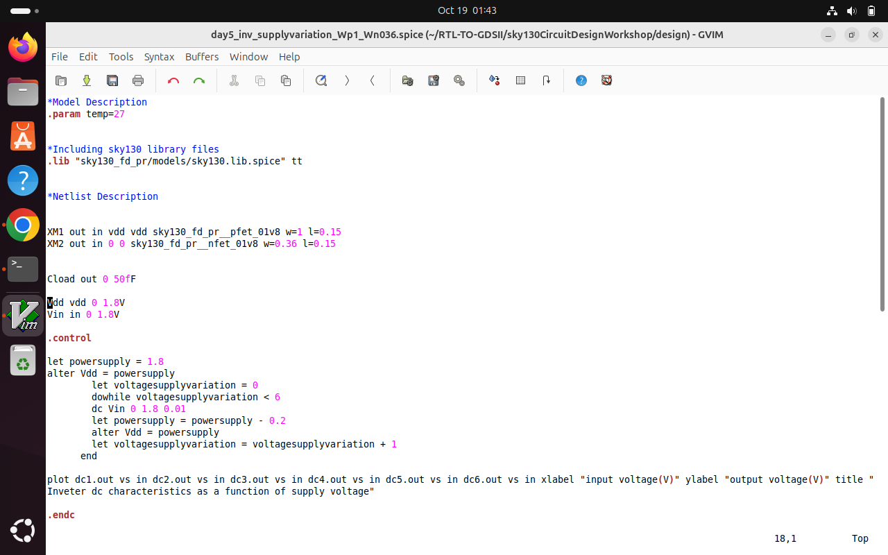
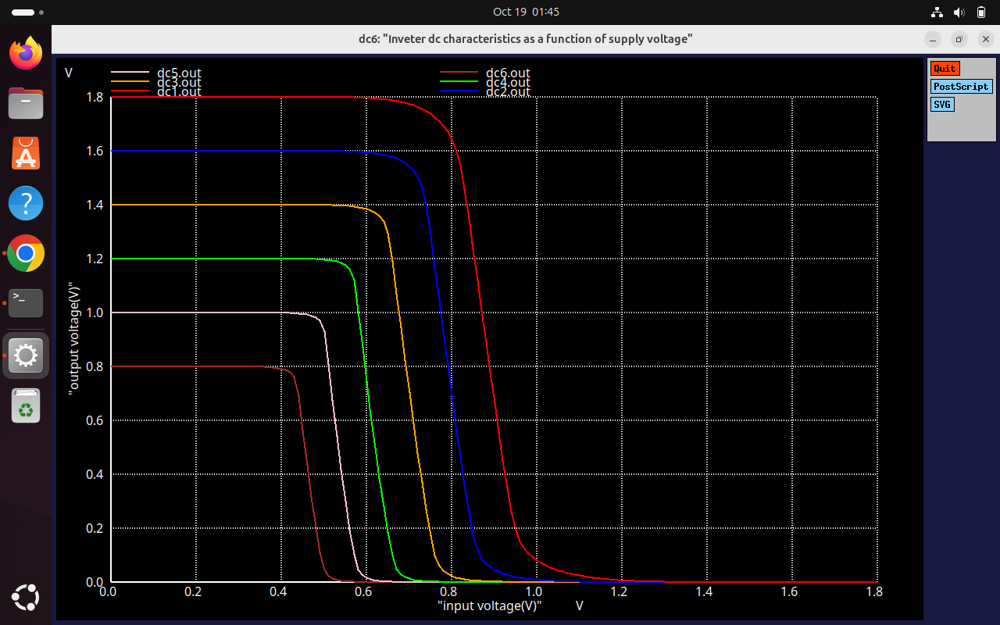
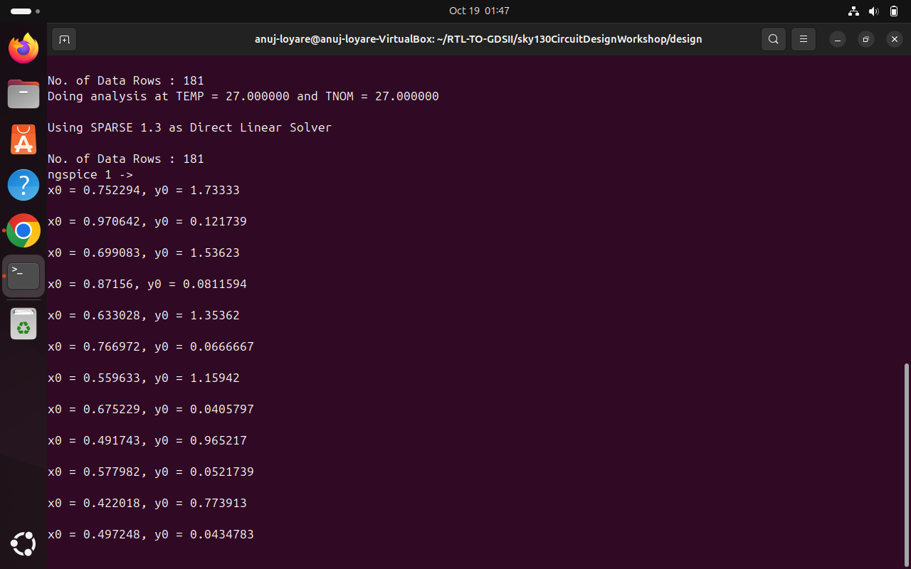
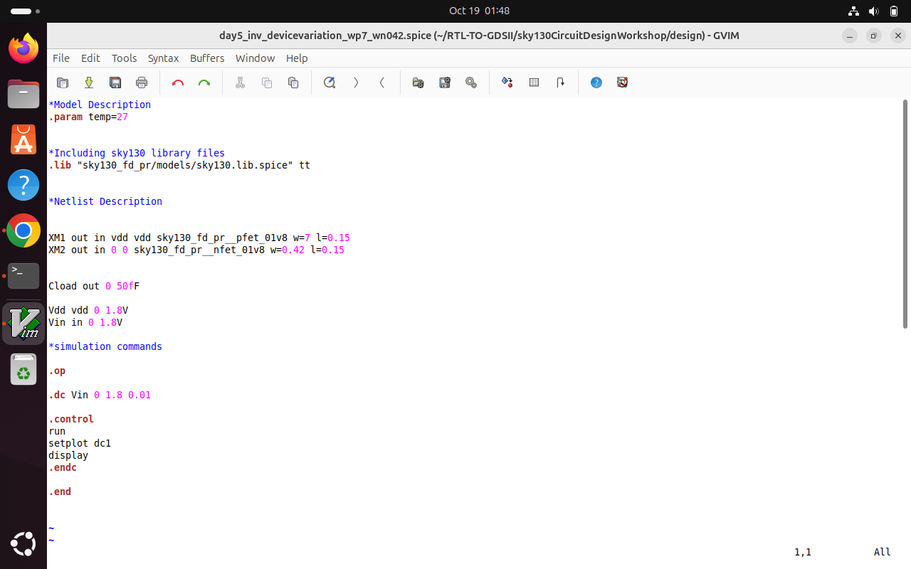
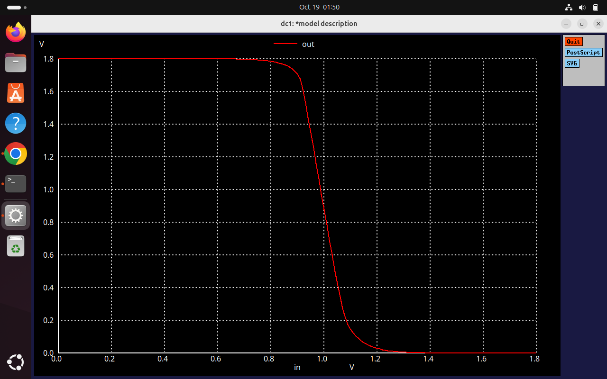

# Day 5: Static Behavior Evaluation - Power Supply Scaling

## Table of Contents
1. [Introduction](#introduction)
2. [Power Supply Scaling](#power-supply-scaling)
3. [Lab Session](#lab-session)
4. [Conclusions](#conclusions)

---

## Introduction

Day 5 focuses on **power supply scaling** and its impact on CMOS inverter robustness. We analyze how varying VDD affects:
- Voltage Transfer Characteristic (VTC)
- Switching behavior
- Gain
- Energy consumption
- Performance

---

## Power Supply Scaling

### 3. Power Supply Scaling

Power supply voltage (VDD) is a critical parameter that affects all aspects of CMOS inverter operation.

---

### VTC for Different Power Supplies

We analyze Vin vs Vout characteristics for different supply voltages to understand the impact of voltage scaling.

**Supply Voltages Analyzed:**
- VDD = 1.8V (nominal)
- VDD = 1.2V (reduced)
- VDD = 0.8V (low power)
- VDD = 0.5V (ultra-low power)

**Observations:**
- Lower VDD reduces voltage swing
- Switching threshold (Vm) scales proportionally
- VTC slope changes with supply voltage
- Noise margins are affected

---

### Advantages of Using 0.5V Supply

#### **1. Increase in Gain**

**Observation:**
At lower supply voltages, the VTC curve exhibits **higher gain** (steeper slope) in the transition region.

**Reason:**
- Reduced VDD brings transistors closer to subthreshold region
- Enhanced sensitivity to input voltage changes
- Sharper transition between logic levels

**Benefit:**
- Better noise rejection
- Improved switching characteristics
- Enhanced signal integrity

---

#### **2. Significant Reduction in Energy**

**Energy Consumption:**
Dynamic energy per switching event is given by:
```
E = CL × VDD²
```

**Energy Comparison:**

| VDD | Relative Energy | Energy Reduction |
|-----|-----------------|------------------|
| 1.8V | 1.00× | Baseline |
| 1.2V | 0.44× | 56% reduction |
| 0.8V | 0.20× | 80% reduction |
| 0.5V | 0.08× | **92% reduction** |

**Key Insight:**
Reducing supply voltage from 1.8V to 0.5V provides approximately **92% energy savings** - a significant reduction!

**Benefits:**
- Lower power consumption
- Reduced heat dissipation
- Extended battery life in portable devices
- Improved energy efficiency
- Better thermal management

---

### Disadvantages of Using 0.5V Supply

#### **Performance Impact**

**Observation:**
Lower supply voltage significantly degrades circuit speed and performance.

**Issues:**

1. **Increased Propagation Delay:**
   - Lower VDD reduces overdrive voltage (Vgs - Vth)
   - Reduced current drive capability
   - Slower charging/discharging of load capacitance
   - Delay increases by 5-10× at 0.5V compared to 1.8V

2. **Reduced Noise Margins:**
   - Smaller voltage swing reduces absolute noise margins
   - NM scales with VDD
   - Increased susceptibility to noise and variations

3. **Threshold Voltage Concerns:**
   - At 0.5V, close to threshold voltage (Vth ≈ 0.4V)
   - Limited overdrive voltage
   - Increased sensitivity to Vth variations
   - Subthreshold leakage becomes significant

4. **Process Variation Sensitivity:**
   - Lower VDD magnifies impact of process variations
   - Reduced operating margins
   - Potential functionality issues at corners

**Trade-off:**
- Energy savings vs. Performance
- Must balance power requirements with speed requirements
- Application-specific optimization needed

---

## Lab Session

### Experiment: Supply Voltage Variation Analysis

**Objective:** 
Analyze the impact of power supply scaling on CMOS inverter VTC, gain, and robustness.

---

### Step 1: Navigate to Design Directory

```bash
# 1. Change to your circuit design directory
cd ~/sky130_circuit_design_workshop/design
```

---

### Step 2: Open Netlist

```bash
# 2. Open the SPICE netlist file in the gvim editor
gvim day5_inv_supplyvariation_wp1_wn0.36.spice
```

---

### Step 3: Run Simulation

```bash
# 3. Run the simulation using ngspice
ngspice day5_inv_supplyvariation_wp1_wn0.36.spice
```

---
<div align="center">
  
</div>
<div align="center">
  
</div>
<div align="center">
  
</div>
<div align="center">
  
</div>
<div align="center">
  
</div>

## Conclusions

### Key Findings from Day 5:

1. **Power Supply Scaling Impact:**
   - VDD directly affects voltage swing and switching behavior
   - VTC characteristics change significantly with supply voltage
   - Switching threshold (Vm) scales proportionally with VDD

2. **Advantages of Low Voltage (0.5V):**
   - **Increased Gain:** Steeper VTC transition, better noise rejection
   - **Significant Energy Reduction:** ~92% energy savings compared to 1.8V
   - Lower power consumption and heat dissipation
   - Extended battery life for portable applications

3. **Disadvantages of Low Voltage (0.5V):**
   - **Performance Impact:** 5-10× increase in propagation delay
   - Reduced noise margins (absolute values)
   - Limited overdrive voltage (Vgs - Vth)
   - Increased sensitivity to process variations
   - Threshold voltage concerns and subthreshold leakage

4. **Design Trade-offs:**
   - Energy vs. Performance optimization required
   - Application-specific voltage selection
   - Ultra-low power: 0.5V suitable for IoT, wearables
   - High performance: Higher VDD needed for speed-critical paths
   - Multi-VDD designs can optimize both

5. **Connection to STA:**
   - Supply voltage variations affect timing significantly
   - Must characterize cells at multiple VDD levels
   - Voltage scaling impacts setup/hold margins
   - Dynamic voltage scaling requires multi-mode timing analysis
   - IR drop effects become critical at low voltages

---

### Summary of Week 4 Task:

**Complete CMOS Circuit Design Journey:**

- **Day 1:** MOSFET behavior, Id-Vds characteristics, SPICE fundamentals
- **Day 2:** Velocity saturation effects, short-channel behavior
- **Day 3:** CMOS inverter VTC, operating regions, transient analysis
- **Day 4:** Switching threshold, noise margins, robustness evaluation
- **Day 5:** Power supply scaling, energy-performance trade-offs

**Key Takeaways:**
- Transistor-level physics drives circuit timing and behavior
- SPICE simulation validates analytical models
- Static analysis (VTC, noise margins) ensures robustness
- Dynamic analysis (delays, transients) determines performance
- Power supply scaling offers energy savings with performance trade-offs
- All insights directly applicable to STA timing closure and optimization

---

**Author**: [Anuj Loyare]  
**Date**: October 19, 2025  
**Workshop**: SKY130 CMOS Circuit Design - Day 5
