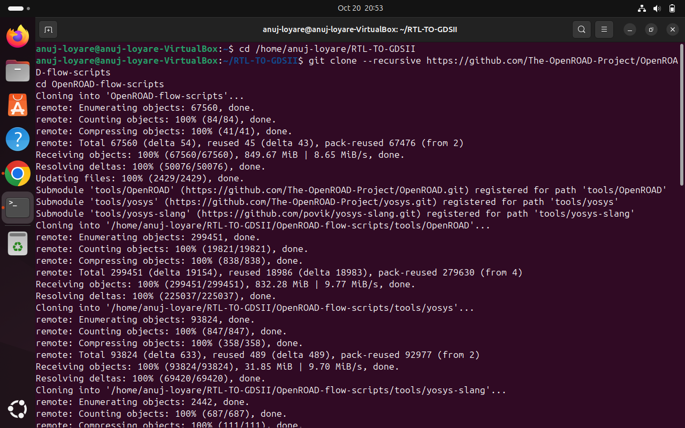
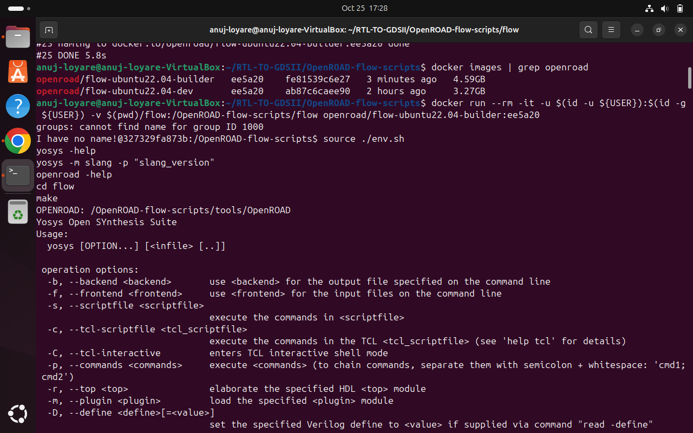

# Week 5 Task – OpenROAD Flow Setup and Floorplan + Placement

## Objective
To set up the OpenROAD Flow Scripts environment and execute the Floorplan and Placement stages of the physical design flow.

## Task Overview
This task transitions from SPICE-level transistor design to backend implementation, where logic is converted into an actual physical layout using OpenROAD, an open-source RTL-to-GDSII flow.

---

## Part 1: OpenROAD Flow Scripts Installation

### Prerequisites Check

#### 1. Verify System Requirements
```bash
# Check Docker installation
docker --version

# Check available memory
free -h

# Check disk space
df -h ~

# Check CPU cores
nproc

# Verify Docker can access all CPUs
docker run --rm ubuntu:22.04 nproc
```

**System Configuration:**
- **OS**: Ubuntu 24.04 LTS
- **RAM**: 16 GB
- **CPU Cores**: 9
- **Docker Version**: 28.5.1
- **Disk Space**: 14 GB available

---

### 2. Clone OpenROAD Flow Scripts Repository

```bash
cd ~/Desktop
git clone --recursive https://github.com/The-OpenROAD-Project/OpenROAD-flow-scripts
cd OpenROAD-flow-scripts
```

<div align="center">
  
</div>
---

### 3. Build OpenROAD Using Docker

```bash
cd ~/Desktop/OpenROAD-flow-scripts
./build_openroad.sh --threads 6
```

**Build Configuration:**
- Build method: Docker from sources
- Base OS: Ubuntu 22.04
- Thread count: 6 cores
- Build time: ~2 hours

---

### 4. Verify Installation

```bash
# Check created Docker images
docker images | grep openroad

# Verify OpenROAD version
docker run --rm openroad/flow-ubuntu22.04-builder:ee5a20 openroad -version
```

**Docker Images Created:**
| Image Name | Tag | Size |
|------------|-----|------|
| openroad/flow-ubuntu22.04-builder | ee5a20 | 4.59GB |
| openroad/flow-ubuntu22.04-dev | ee5a20 | 3.27GB |

---

### 5. Test Complete Flow (GCD Design)

```bash
cd ~/Desktop/OpenROAD-flow-scripts/flow

# Run complete RTL-to-GDSII flow for verification
docker run --rm -it \
  -u $(id -u ${USER}):$(id -g ${USER}) \
  -v $(pwd):/OpenROAD-flow-scripts/flow \
  openroad/flow-ubuntu22.04-builder:ee5a20 \
  bash -c "source ./env.sh && make"
```
<div align="center">
  
</div>

**Flow Stages Executed:**
1. ✅ Synthesis (Yosys)
2. ✅ Floorplan
3. ✅ Placement
4. ✅ CTS (Clock Tree Synthesis)
5. ✅ Routing
6. ✅ Finishing


<div align="center">
  
</div>

<div align="center">
  
</div>
<div align="center">
  
</div>

---


## Part 3: Placement Stage Execution

### 1. Execute Global Placement

```bash
cd ~/Desktop/OpenROAD-flow-scripts/flow

# Run placement stage
make DESIGN_CONFIG=./designs/nangate45/gcd/config.mk place
```

**Placement Stage Sub-steps:**
- Global Placement (Initial cell positioning)
- I/O Placement
- Detailed Placement (Legal cell positions)
- Placement optimization

---

### 2. View Placement in GUI

```bash
# Open placement result in OpenROAD GUI
docker run --rm -it \
  -u $(id -u ${USER}):$(id -g ${USER}) \
  -v $(pwd):/OpenROAD-flow-scripts/flow \
  -e DISPLAY=${DISPLAY} \
  -v /tmp/.X11-unix:/tmp/.X11-unix \
  -v ${HOME}/.Xauthority:/.Xauthority \
  --network host \
  --security-opt seccomp=unconfined \
  openroad/flow-ubuntu22.04-builder:ee5a20 \
  bash -c "source ./env.sh && openroad -gui ./results/nangate45/gcd/base/3_place.odb"
```

**Placement View - Key Elements:**
- Standard cells placed in rows
- No overlapping cells
- Power rails connected
- Optimized for timing and area


---

### 3. Check Placement Logs

```bash
# View placement stage logs
cat logs/nangate45/gcd/base/3_*_place.log
```


---

## Results Summary

### Floorplan Stage Results
| Parameter | Value |
|-----------|-------|
| Die Width | 29.4 um |
| Die Height | 28.6 um |
| Core Area | 840 um² |
| Core Utilization | 73% |
| Power Grid | PDN created |

### Placement Stage Results
| Parameter | Value |
|-----------|-------|
| Total Cells | 932 cells |
| Cell Types | Combinational, Sequential, Buffers |
| Placement Method | Global + Detailed |
| Legalization | ✅ Successful |

---

## Generated Files

### Floorplan Output Files
```
results/nangate45/gcd/base/
├── 2_1_floorplan.odb
├── 2_2_floorplan_macro.odb
├── 2_3_floorplan_tapcell.odb
└── 2_4_floorplan_pdn.odb
```

### Placement Output Files
```
results/nangate45/gcd/base/
├── 3_1_place_gp_skip_io.odb
├── 3_2_place_iop.odb
├── 3_3_place_gp.odb
├── 3_4_place_resized.odb
└── 3_5_place_dp.odb
```

---

## Challenges Faced and Solutions

### Challenge 1: Disk Space
**Issue**: Initial disk space was only 11GB, which was insufficient for the build.

**Solution**: 
- Cleaned Docker images and containers: `docker system prune -a`
- Cleaned APT cache: `sudo apt clean`
- Cleaned journal logs: `sudo journalctl --vacuum-time=7d`
- Freed up ~3GB, bringing total to 14GB

### Challenge 2: Docker Image Tag
**Issue**: Built image had tag `ee5a20` instead of `latest`, causing "image not found" error.

**Solution**: Used specific tag in Docker commands:
```bash
openroad/flow-ubuntu22.04-builder:ee5a20
```

### Challenge 3: GUI Display
**Issue**: X11 display not accessible from Docker container.

**Solution**: Added X11 forwarding and proper volume mounts:
```bash
xhost +local:docker
-e DISPLAY=${DISPLAY}
-v /tmp/.X11-unix:/tmp/.X11-unix
-v ${HOME}/.Xauthority:/.Xauthority
```

---

## Key Learnings

1. **Floorplanning**: Understanding how die area, core utilization, and power distribution are planned before placement.

2. **Placement**: Learning how standard cells are positioned legally in rows while optimizing for timing and wirelength.

3. **Docker Workflow**: Using containerization for reproducible VLSI design flows without local tool installation complexity.

4. **OpenROAD Tools**: Hands-on experience with industry-standard open-source EDA tools for physical design.

---

## Conclusion

Successfully completed Week 5 task by:
- ✅ Installing OpenROAD Flow Scripts using Docker
- ✅ Executing Floorplan stage with proper die and core area setup
- ✅ Executing Placement stage with legal cell positioning
- ✅ Visualizing results using OpenROAD GUI
- ✅ Understanding physical design flow from RTL to placed design

**Next Steps**: Proceed with Clock Tree Synthesis (CTS) and Routing stages in future weeks.

---

## References

- [OpenROAD Flow Scripts Documentation](https://openroad-flow-scripts.readthedocs.io/)
- [OpenROAD Project GitHub](https://github.com/The-OpenROAD-Project/OpenROAD-flow-scripts)
- [Task Reference Repository](https://github.com/spatha0011/spatha_vsdhdp/blob/main/Day14/README.md)

---

## Author Information

**Name**: Anuj Loyare  
**System**: Ubuntu 24.04 LTS (VirtualBox)  
**Date**: October 25, 2025  
**Task**: Week 5 - OpenROAD Flow Setup and Floorplan + Placement

---


## Quick Commands Summary

```bash
# Installation
cd ~/Desktop
git clone --recursive https://github.com/The-OpenROAD-Project/OpenROAD-flow-scripts
cd OpenROAD-flow-scripts
./build_openroad.sh --threads 6

# Verification
docker images | grep openroad

# Floorplan
cd flow
make clean_all DESIGN_CONFIG=./designs/nangate45/gcd/config.mk
make DESIGN_CONFIG=./designs/nangate45/gcd/config.mk floorplan

# Placement
make DESIGN_CONFIG=./designs/nangate45/gcd/config.mk place

# GUI Viewing
xhost +local:docker
# Use docker run commands provided in sections above
```
